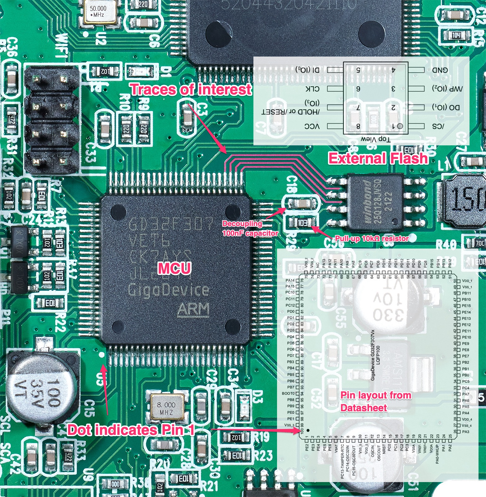
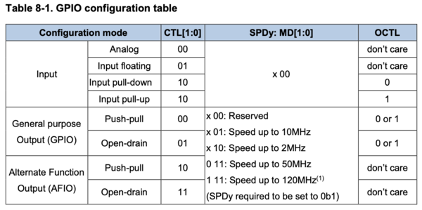

Planning to read the external flash
===================================

## Discovering the MCU and external flash wiring

We'd like to start running some code on the MCU. Let's pick a simple task.
We could blink an LED on the board, but there's more interesting.
How about accessing the external flash chip next to the MCU, and read all of its
content. It should contain the UI graphics of the touch screen, and perhaps the
FPGA bitstream (the FPGA firmware if you will).

Referring to the [pcb](../pcb) photos, and the [datasheets](../datasheet) of the
MCU and the flash chip, we can figure out how they talk to each other.



We see that the Flash is getting power via `VCC` on the `3.3V` supply. A pull-up
resistor is connected to `/RESET` to enable the chip. the `GND` pin is connected
to the ground.

We see that the MCU and the flash chip are connected via 4 traces.

 MCU Pin | Flash Pin
---------|----------
`PB12`   | `DO` or `/WP` or `/CS`
`PB13`   | `CLK`
`PB14`   | `DO` or `/WP` or `/CS`
`PB15`   | `DI`

It's not clear where the `PB12` and `PB14` are connected to without desoldering
the flash chip.

In the flash chip datasheet, we learn that the chip communicates via the Serial
Peripheral Interface (SPI). Essentially, data flowing from one chip to another
is done on a single wire (`DI` or `DO`) and bits are flowing at the rate
indicated by the `CLK` wire.

Multiple chips can be connected to the same SPI bus, and so there's a chip
select wire to select which chip is being talked to. The datasheet indicates
that the power consumption goes down when the chip select pin is low, so that's
a good reason to use this wire, even if there's only one chip on the SPI bus.

The `/WP` pin (Write Protect) is to turn the chip to read-only mode. I doubt
that this is actually used, and is probably hard wired to be inactive. But we
never know, it could actually be popular to use this wire, and not care about
energy consumption (makes sense, we are not on a battery powered system).

 Flash Pin | Description
-----------|----------
`/CS`      | Chip Select Input
`/WP`      | Write Protect Input
`CLK`      | Serial Clock Input
`DI`       | Data Input
`DO`       | Data Output

On the MCU data sheet, we learn the following (page 29):

MCU Pin | Description
--------|--------------
`PB12`  | GPIO, or `SPI1_NSS` (slave select)
`PB13`  | GPIO, or `SPI1_SCK` (SPI clock output)
`PB14`  | GPIO, or `SPI1_MISO` (Data reception line)
`PB15`  | GPIO, or `SPI1_MOSI` (Data transmission line)

We deduct that the MCU and the flash chip is connected in the following way:

 MCU Pin | Flash Pin
---------|----------
`PB12`   | `/CS` or `/WP`
`PB13`   | `CLK`
`PB14`   | `DO`
`PB15`   | `DI`

## Reading the pin configuration of the MCU

The MCU adapts for a variety of use-cases. Therefore, they must include a way to
configure each pin in whatever way the hardware designer wishes.
These pins are called General Purpose Input/Output (GPIO) pins.

These pins are grouped into packs of 16. We call such group a port, and give it
a letter. For example, the pin `PB12` is the pin `12` of the port `B`.

Each GPIO port is controlled via special registers such as `CTL0`, `CTL`, `ISTAT`,
`OCTL`.

The datasheet tells us where these registers are located

Port     | Address
---------|-------------
`Port A` | `0x40010800`
`Port B` | `0x40010C00`
`Port C` | `0x40011000`
`Port D` | `0x40011400`
`Port E` | `0x40011800`
`Port F` | `0x40011C00`
`Port G` | `0x40012000`

With the J-Link probe, we can read the 4 registers of each of the 7 ports (A-G):

```
J-Link>Mem32 0x40010800, 4
40010800 = BBB3B3B3 88844383 0000C615 0000A615
J-Link>Mem32 0x40010C00, 4
40010C00 = 33088440 BBB3734B 0000FE0A 00001C18
J-Link>Mem32 0x40011000, 4
40011000 = 33444333 44344483 0000FEFF 000022C7
J-Link>Mem32 0x40011400, 4
40011400 = B0BB00BB BB43BBBB 0000E7B3 00000080
J-Link>Mem32 0x40011800, 4
40011800 = B3334434 BBBBBBBB 0000FF8D 00000000
J-Link>Mem32 0x40011C00, 4
40011C00 = 44444444 44444444 00000D94 00000000
J-Link>Mem32 0x40012000, 4
40012000 = 44444444 44444444 0000E48A 00000000
```

Here's the equivalent OpenOCD commands:

```
> mdw 0x40010800 4
0x40010800: bbb3b3b3 88844383 0000c614 0000a614

> mdw 0x40010C00 4
0x40010c00: 33088440 bbb3734b 0000fe0a 00001c18

> mdw 0x40011000 4
0x40011000: 33444333 44344483 0000feff 000022c7

> mdw 0x40011400 4
0x40011400: b0bb00bb bb43bbbb 0000e7b3 00000080

> mdw 0x40011800 4
0x40011800: b3334434 bbbbbbbb 0000ff8d 00000000

> mdw 0x40011C00 4
0x40011c00: 44444444 44444444 00000d94 00000000
```

For each pin, the configuration is the following:



Decoding the meaning of these 4 registers is not obvious, so I wrote a python
script that you can find at [`firmware/print_port_config.py`](../firmware/print_port_config.py).
The full pin configuration can be found at [`firmware/port_config.txt`](../firmware/port_config.txt).

We see the 4 pins of interest being configured as such:

Pin    | Config
-------|------
`PB12` | Output push-pull v=1 speed=50Mhz
`PB13` | Alternate output push-pull speed=50Mhz
`PB14` | Alternate output push-pull speed=50Mhz
`PB15` | Alternate output push-pull speed=50Mhz

Alternate output means the pin is no longer controlled directly by the user, but
rather by an on chip hardware peripheral, such as the SPI module.

The configuration makes perfect sense. `PB12` could be acting on the chip select pin
of the flash device. `v=1` means that the chip is not selected (it's an active
low, meaning that it's active when voltage is low on the pin). It could also be
connected to `/WP`, in which case it disables the write protection (but that
would be strange, it should only be configured in this way when we are updating
the firmware).

We don't really know if `PB12` is connected to `/CS` (but I say it's very
likely). We'll figure this out when trying to read the flash content.

`PB13`, `PB14`, `PB15` are connected to the MCU's `SPI1` module. Good, it should
be blazing fast, and we won't have to write much code to implement the SPI
protocol if we needed to.

## Reading the external flash content

### Using J-Link

We can consider using the Indirect Mode of the J-Link probe (see
[here](https://wiki.segger.com/Programming_External_SPI_Flashes)).
We are told that we'll need a custom RAMCode (code that runs on the MCU) to
access the external flash, and there's some instructions
[here](https://wiki.segger.com/Open_Flashloader#Create_a_Flash_Loader) on how to
create such RAMCode.

### Using OpenOCD

It looks like there's support for external flash as shown
[here](https://www.openocd.org/doc/html/Flash-Commands.html#index-cfi), with the
`cfi` flash driver. But the documentation is really bad. How do we even specify
what pins should be used by the flash driver?

### Writing our own code

It's time to dip our feet in the water and write some code that runs on the MCU.
See next [part](../part2/README.md)
