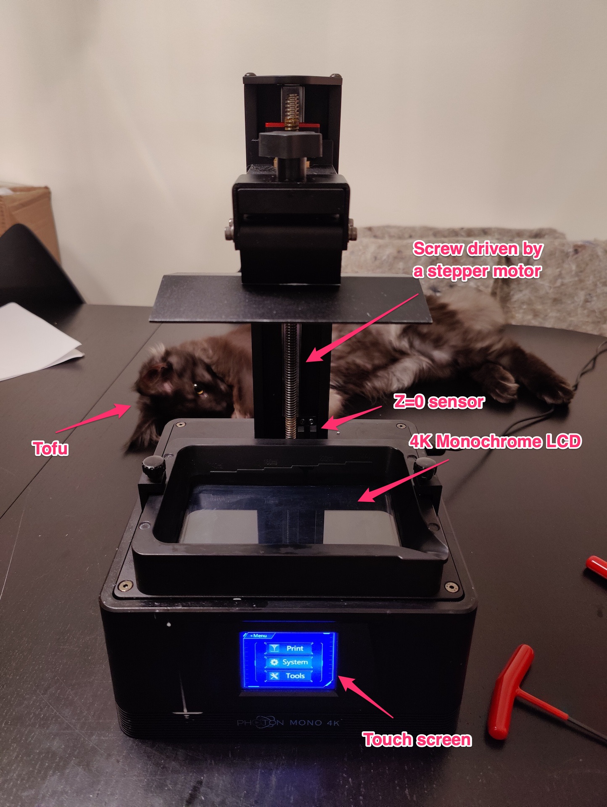
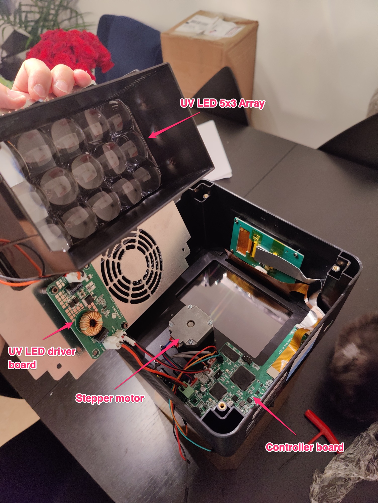
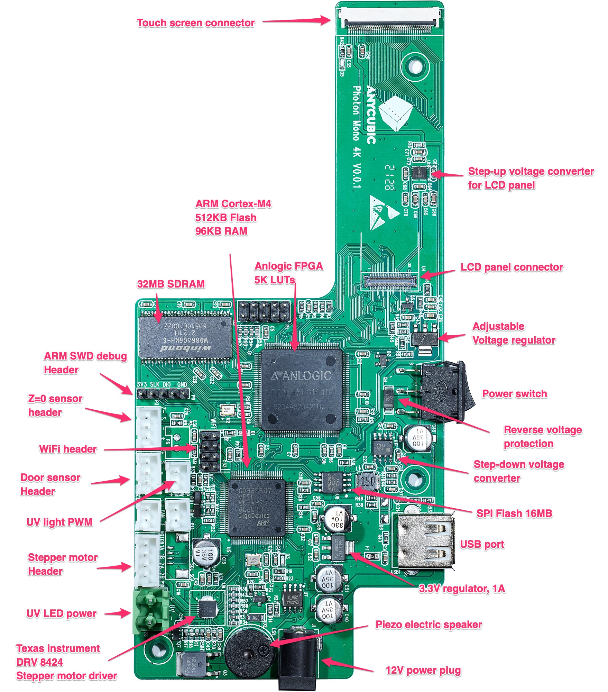
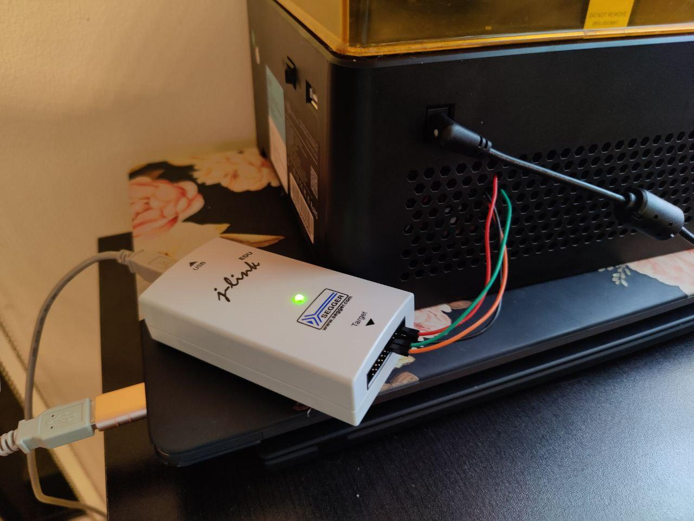
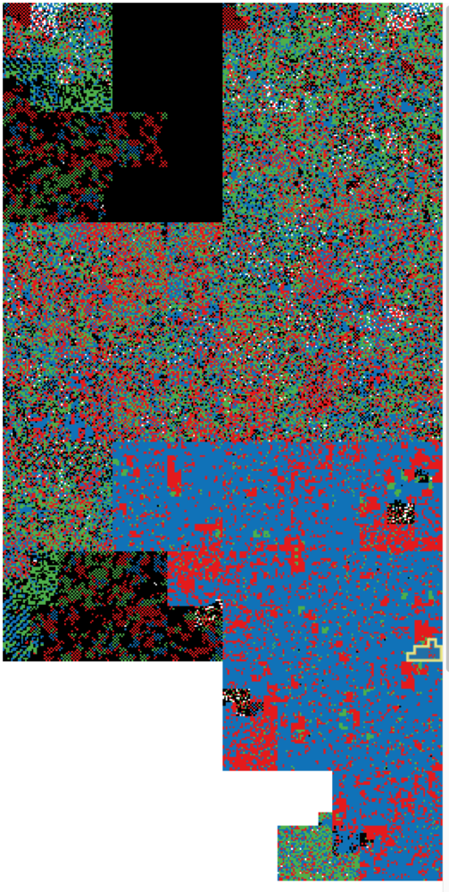

Part 1: Discovery of the hardware and firmware extraction
=========================================================

## Hardware discovery



We can open the printer from the bottom panel via 4 hex screws. We see the UV array,
the stepper motor, and the controller board.

Note that there is no fan. Perhaps we could install one with a heater to have a
temperature controlled environment. Some resins do better at 30°C.



I took high quality photos of the main controller board, it will be helpful
later to figure out the schematic. You may find the high resolution photos in
the [pcb/](../pcb) folder, front and back.

Here's the board annotated.



The inside of the Mono 4K is very similar to the original Mono:
https://bleughbleugh.wordpress.com/2020/10/12/anycubic-photon-mono-teardown-part-1/

A couple of important components:
* GigaDevice GD32F307VET6 Arm Cortex M4 MCU. It has 512KB of internal flash, and 96KB of RAM.
* Anlogic FPGA EF2L45LG144B driving the LCD Panel.
* Winbond 25Q128JVSQ 16MB flash SPI chip used by the MCU.
* Winbond W9864G6KH-6 32MB SDRAM chip used by the FPGA.

You can find their datasheets in [`datasheet/`](../datasheet/).

## Connecting to the ARM MCU

Before attempting writing a new firmware for the unit, it's going to be helpful
to see what they are doing:
* We'll need to understand how to update the firmware from the regular way so
  that we can have users trying out our new firmware.
* How do we talk to the FPGA? It's easier to see the firmware than hooking a
  logic analyzer to the FPGA/MCU bus.

Anycubic does not provide a firmware for the Mono 4K at this time. (See on the
official anycubic website
[here](https://www.anycubic.com/blogs/news/all-you-need-to-know-about-photon-mono-4k)).
We're going to have to extract it. The hope is to connect via debug protocol to
the MCU. Luckily, there's a nice little header on the top left of the board
looking like like an ARM Serial Wire Debug (SWD) header.

The silk screen on the PCB shows `3V3, SLK, DIO, _, GND`.

I connect my [J-Link](https://www.segger.com/products/debug-probes/j-link/)
probe to the header following their
[pinouts](https://www.segger.com/products/debug-probes/j-link/technology/interface-description/#swd-connector-pinout).
`3V3` goes to `VTref`, `SLK` goes to `SWCLK`, `DIO` goes to `SWDIO`, and `GND`
to `GND`. The `VTref` connection is not really necessary, but we'll plug it in
for good measure.



### J-Link

We're ready to run the following:

```
» JLinkExe -AutoConnect 1 -Device GD32F307VE -If SWD -Speed 4000

SEGGER J-Link Commander V7.60b (Compiled Dec 22 2021 12:50:26)
DLL version V7.60b, compiled Dec 22 2021 12:50:19

Connecting to J-Link via USB...O.K.
Firmware: J-Link V10 compiled Nov  2 2021 12:14:50
Hardware version: V10.10
VTref=3.300V (fixed)
Device "GD32F307VE" selected.

Connecting to target via SWD
Found SW-DP with ID 0x2BA01477
DPIDR: 0x2BA01477
CoreSight SoC-400 or earlier
Scanning AP map to find all available APs
AP[1]: Stopped AP scan as end of AP map has been reached AP[0]: AHB-AP (IDR: 0x24770011)
Iterating through AP map to find AHB-AP to use
AP[0]: Core found
AP[0]: AHB-AP ROM base: 0xE00FF000
CPUID register: 0x410FC241. Implementer code: 0x41 (ARM)
Found Cortex-M4 r0p1, Little endian.
FPUnit: 6 code (BP) slots and 2 literal slots
CoreSight components:
ROMTbl[0] @ E00FF000
[0][0]: E000E000 CID B105E00D PID 000BB00C SCS-M7
[0][1]: E0001000 CID B105E00D PID 003BB002 DWT
[0][2]: E0002000 CID B105E00D PID 002BB003 FPB
[0][3]: E0000000 CID B105E00D PID 003BB001 ITM
[0][4]: E0040000 CID B105900D PID 000BB9A1 TPIU
[0][5]: E0041000 CID 00000000 PID 00000000 ???
Cortex-M4 identified.
J-Link>
```
Wonderful! We are connected to the MCU, we can do whatever we want it seems,
including halting, reseting, stepping instructions, poking at memory, etc.

### OpenOCD

We can also use [OpenOCD](https://openocd.org/) which looks to be a widely used
tool. It's open-source, unlike the J-Link software. We could learn a few things
using it. Unfortunately, the documentation is poor, so it's going to be challenging.

I managed to make it work with the following. The way it works is that you feed
it a configuration file, and you can connect to it via a TCP connection to
issue commands. It uses the Tcl scripting language.

```
# openocd.cfg

adapter driver jlink
adapter speed 4000
transport select swd

swd newdap mcu cpu -enable
dap create mcu.dap -chain-position mcu.cpu
target create mcu.cpu cortex_m -dap mcu.dap

init
echo [dap info]
```

```
» openocd -f openocd.cfg
Open On-Chip Debugger 0.11.0
Licensed under GNU GPL v2
For bug reports, read
        http://openocd.org/doc/doxygen/bugs.html
Info : J-Link V10 compiled Nov  2 2021 12:14:50
Info : Hardware version: 10.10
Info : VTarget = 3.300 V
Info : clock speed 4000 kHz
Info : SWD DPIDR 0x2ba01477
Info : mcu.cpu: hardware has 6 breakpoints, 4 watchpoints
Info : starting gdb server for mcu.cpu on 3333
Info : Listening on port 3333 for gdb connections
AP ID register 0x24770011
        Type is MEM-AP AHB3
MEM-AP BASE 0xe00ff003
        Valid ROM table present
                Component base address 0xe00ff000
                Peripheral ID 0x07000d1329
                Designer is 0x7d1, GigaDevice Semiconductor (Beijing) Inc
                Part is 0x329, Unrecognized
                Component class is 0x1, ROM table
                MEMTYPE system memory present on bus
        ROMTABLE[0x0] = 0xfff0f003
                Component base address 0xe000e000
                Peripheral ID 0x04000bb00c
                Designer is 0x4bb, ARM Ltd
                Part is 0xc, Cortex-M4 SCS (System Control Space)
                Component class is 0xe, Generic IP component
        ROMTABLE[0x4] = 0xfff02003
                Component base address 0xe0001000
                Peripheral ID 0x04003bb002
                Designer is 0x4bb, ARM Ltd
                Part is 0x2, Cortex-M3 DWT (Data Watchpoint and Trace)
                Component class is 0xe, Generic IP component
        ROMTABLE[0x8] = 0xfff03003
                Component base address 0xe0002000
                Peripheral ID 0x04002bb003
                Designer is 0x4bb, ARM Ltd
                Part is 0x3, Cortex-M3 FPB (Flash Patch and Breakpoint)
                Component class is 0xe, Generic IP component
        ROMTABLE[0xc] = 0xfff01003
                Component base address 0xe0000000
                Peripheral ID 0x04003bb001
                Designer is 0x4bb, ARM Ltd
                Part is 0x1, Cortex-M3 ITM (Instrumentation Trace Module)
                Component class is 0xe, Generic IP component
        ROMTABLE[0x10] = 0xfff41003
                Component base address 0xe0040000
                Peripheral ID 0x04000bb9a1
                Designer is 0x4bb, ARM Ltd
                Part is 0x9a1, Cortex-M4 TPIU (Trace Port Interface Unit)
                Component class is 0x9, CoreSight component
                Type is 0x11, Trace Sink, Port
        ROMTABLE[0x14] = 0xfff42003
                Component base address 0xe0041000
                Invalid CID 0x00000000
        ROMTABLE[0x18] = 0x0
                End of ROM table

Info : Listening on port 6666 for tcl connections
Info : Listening on port 4444 for telnet connections
```

Looks like we can use this tool as well.

## Dumping the MCU firmware

The Anycubic Mono 4K controller board is a derivate board from Chitu systems.
You can see boards they are offering [here](https://shop.chitusystems.com/product-category/).

In the [download section](https://shop.chitusystems.com/download/), they show an
FPGA firmware, a core firmware, and a UI firmware.

Right now, we are after the core firmware, which sits in the MCU, and I couldn't
find a firmware to download for the Mono 4K.

### With J-Link software

With the JLink software, it's rather straightforward to dump the firmware with
the `savebin` command:

```
J-Link> savebin mcu.bin 0 0x80000
Opening binary file for writing... [mcu.bin]
Reading 524288 bytes from addr 0x00000000 into file...O.K.
```

### With OpenOCD

Same with OpenOCD it turns out.

```
» nc localhost 4444
Open On-Chip Debugger
> dump_image rom.bin 0 0x80000
dumped 524288 bytes in 2.174999s (235.402 KiB/s)
```

Both methods give us the same thing. We have the MCU firmware on disk. You can
find it in [`firmware/`](../firmware/).

## Quick analysis

Let's look at the firmware on [binvis](https://binvis.io/).



It looks right (not encrypted, nor all blank).

We can look at the strings that are contained in this binary.

```
» strings mcu.bin | sort -u

[...cut...]
R_E_R_F
Switched to English!
FPGA upgrade succeeded,
Failed to open file!
Fan Speed(%)
Home first,then move z to bottom!
Homing,please wait...
V0.0.11
```

The firmware we have extracted is good. It's useful to keep, because we are
going to replace it with our own. It's always a good thing to be able to revert
our changes.

Next, we'll try to access the external flash on the board.

[Go to Part 2](/part2/README.md)
