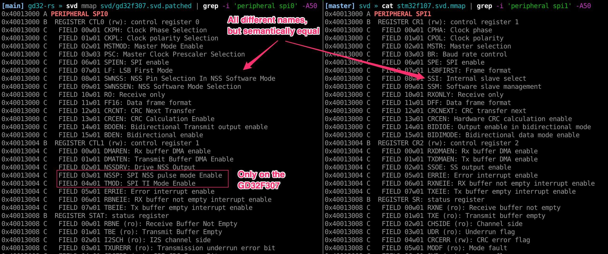
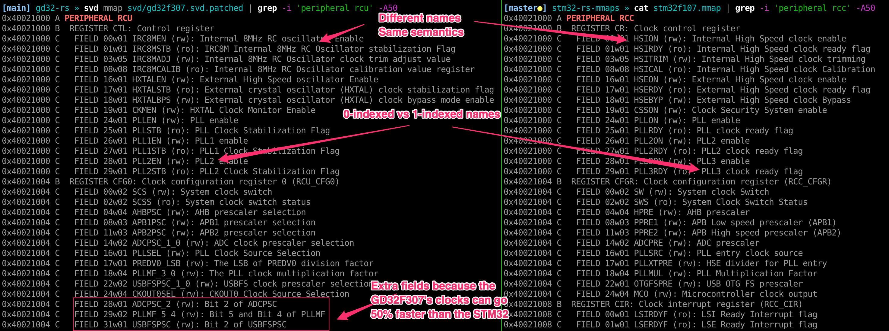

Part 4: Dumping the content of the external flash
=================================================

There's two things we need to accomplish:
* Send large amount of bytes from the device to the host, as we
  are planning to dump 32MB of flash after all. We'll do this with the
  semihosting features.
* Read the SPI flash. Hopefully we can find some already written code to do
  that.

## Sending files from the device to the host

ARM defines semihosting operations meant for a device to communicate with a
host runnign a debugger. See [What is
semihosting?](https://developer.arm.com/documentation/dui0471/i/semihosting/what-is-semihosting-?lang=en)

In a nutshell, the device invokes a system call (via the `BKPT 0xAB` instruction
on the Cortex-M4). This traps the debugger. The register `r0` contains the
system call number, and `r1` contains a pointer to the system call arguments.

The system calls are the classic `SYS_OPEN`, `SYS_WRITE`, etc. The list of
system call can be found
[here](https://developer.arm.com/documentation/dui0471/i/semihosting/semihosting-operations?lang=en).
We can look at the documentation of
[`SYS_OPEN`](https://developer.arm.com/documentation/dui0471/i/semihosting/sys-open--0x01-?lang=en)
or
[`SYS_WRITE`](https://developer.arm.com/documentation/dui0471/i/semihosting/sys-write--0x05-?lang=en).

> SYS_WRITE (0x05)
> 
> Writes the contents of a buffer to a specified file at the current file position.
> Perform the file operation as a single action whenever possible. For example,
> do not split a write of 16KB into four 4KB chunks unless there is no
> alternative.
> 
> On entry, R1 contains a pointer to a three-word data block:
> * word 1: contains a handle for a file previously opened with SYS_OPEN
> * word 2: points to the memory containing the data to be written
> * word 3: contains the number of bytes to be written from the buffer to the file.
> 
> On exit, R0 contains:
> * 0 if the call is successful
> * the number of bytes that are not written, if there is an error.

This is very similar to a hypervisor call if the device was running in a virtual
machine. Except that here, the host is attached via a debugging probe.

Note that invoking a system call pauses the device execution, and thus is not
appropriate for real-time executions as the invokation will be slow (100's of
millisecs).

Another approach to logging is to use [Instrumentation Trace Macrocell
(ITM)](https://developer.arm.com/documentation/ddi0489/f/instrumentation-trace-macrocell-unit),
which is little more involved to setup compared to semihosting as it turns one
of the device pin as an asynchronous serial port, so we'd have to setup the
clock of the device and properly synchronize the device and the host data rates.
The nice thing about semihosting is the richness of the API via the various
system calls. It's not just for logging.

The `cortex-m-semihostring` crate does not expose any API to create files on the
host, even though it seems that we could use the `SYS_OPEN` system call as
OpenOCD implements it well. See its
[implementation](https://github.com/openocd-org/openocd/blob/aad87180586a43500f8af1cf79255c7293bb258b/src/target/semihosting_common.c#L633).
It also implements all the other system call pretty well.

We can add the feature to the `cortex-m-semihosting` crate to export the
`open()` call. See [my pull
request](https://github.com/rust-embedded/cortex-m/pull/387). Hopefully it gets
merged.

Because I am now using my own local copy of the `cortex-m` repository, I add
the following in the `Cargo.toml` file:

```
[patch.crates-io]
cortex-m-semihosting = { path = '../cortex-m/cortex-m-semihosting' }
cortex-m = { path = '../cortex-m' }
```

This instructs cargo to use my version of `cortex-m`, ~~even for dependencies that use
`cortex-m`, like `gd32f3`.~~ Actually it doesn't override the dependencies of
our dependencies, and so it's not really that useful. See this [github
issue](https://github.com/rust-lang/cargo/issues/5640).

When we run the following code on the device:
```rust
#[entry]
fn main() -> ! {
    use cortex_m_semihosting::{hio::open, nr};
    let mut file = open("hello_world.bin\0", nr::open::RW_TRUNC_BINARY).unwrap();
    file.write_all(b"We can send binaries").unwrap();
    loop {}
}
```

We see the `hello_world.bin` file appear on the host (created by OpenOCD):

```
» hexdump -C hello_world.bin
00000000  57 65 20 63 61 6e 20 73  65 6e 64 20 62 69 6e 61  |We can send bina|
00000010  72 69 65 73                                       |ries|
```

Great! Now we know how to send a file from the device to the host. We are left
with interfacing the external flash chip.

## Picking a compatible STM32 device

Now that we need to access and use the SPI on-chip peripheral, we need to use
some sort of HAL. But it would be a waste of time to re-implement the HAL.
Perhaps we can reuse one of the SMT32 HAL.

There's 86 SMT32 device supported with Rust embedded, with all kind of different
register layouts. Our device has ~10,000 register and bit definitions, so it's
not an easy task to match an SMT32 device that we can use as they are all a bit
of a mix of various versions of peripherals.

I found effective to compare the textual representation of the memory register
layout of the `GD32F307` with other STM32s using `svd mmap`. I decided to focus
primarily on the peripheral of interest, namely the `GPIO` ports, `SPI`, and
clock configuration registers.  After manually going through all the devices,
I eventually found a pretty good match, the `SMT32F107` even though it's a
Cortex-M3, and not a Cortex-M4 like the `GD32F307`. It would be tempting to look
at the `SMT32F4xx` family (Cortex-M4), but no, these have complete different
register layouts.





Note that because the `GD32` can go faster than the `STM32` with their
trickeries as seen in the [previous part](/part3/README.md#openocd--gdb-configuration),
there are additional fields to configure the GD32 clock, while remaining
backward compatible with the `STM32` register layout. The `GD32` can run up to
120Mhz, while the `SMT32` can only go to 72Mhz, and so it needs larger clock
multipliers.

We can use the `stm32f1xx-hal` and `stm32f1` crates! Wonderful! This is a big
relief! We add the following in our `Cargo.toml` file, and delete the `gd32-rs`
project. Yay!

```toml
[dependencies.stm32f1xx-hal]
version = "0.6.1"
features = ["rt", "stm32f107", "medium"]
```

## Accessing the flash chip

Because we are using all these nice HAL features, we can actually use an
off-the-shelf [SPI memory library](https://github.com/jonas-schievink/spi-memory/).

We write our code according to the [example provided by the
library](https://github.com/jonas-schievink/spi-memory/blob/master/examples/dump.rs),
and let the IDE fix and autocomplete whatever it needs.
Note that if we misconfigure the I/O pins (output instead of input for example),
the code doesn't compile. Super nice!

```rust
fn main() -> ! {
    // Initialize the device to run at 48Mhz using the 8Mhz crystal on
    // the PCB instead of the internal oscillator.
    let dp = Peripherals::take().unwrap();
    let mut rcc = dp.RCC.constrain();
    let mut flash = dp.FLASH.constrain();
    let clocks = rcc.cfgr
        .use_hse(8.mhz())
        .sysclk(48.mhz())
        .freeze(&mut flash.acr);

    let mut gpiob = dp.GPIOB.split(&mut rcc.apb2);

    // The example in the spi-memory library uses a CS GPIO
    // We have one, great!
    let cs = gpiob.pb12.into_push_pull_output(&mut gpiob.crh);

    // The SPI module
    let spi = {
        let sck = gpiob.pb13.into_alternate_push_pull(&mut gpiob.crh);
        let miso = gpiob.pb14.into_floating_input(&mut gpiob.crh);
        let mosi = gpiob.pb15.into_alternate_push_pull(&mut gpiob.crh);

        spi::Spi::spi2(
            dp.SPI2,
            (sck, miso, mosi),
            // For the SPI mode, I just picked the first option.
            spi::Mode { polarity: spi::Polarity::IdleLow, phase: spi::Phase::CaptureOnFirstTransition },
            clocks.pclk1(), // Run as fast as we can. The flash chip can go up to 133Mhz.
            clocks,
            &mut rcc.apb1,
        )
    };

    // Initialize the spi-memory library
    let mut flash = Flash::init(spi, cs).unwrap();

    // And read the chip JEDEC ID. In the datasheet, the first byte should be
    // 0xEF, which corresponds to Winbond
    let id = flash.read_jedec_id().unwrap();
    hprintln!("id={:?}", id).unwrap();

    loop {}
}
```

Once it compiles, we try to run the program. It should print the flash device
ID.

```
» cargo run
...
id=Identification([ef, 40, 18])
```

OMG! wat! It just worked?! Using the `stm32f107` was a good guess! And Rust
compiler prevented me from making mistakes. I originally had the
`miso`/`gpiob.pb14` configured as alternate push/pull, but that didn't compile,
so I switched to a floating input (which kind of makes sense), and the code
compiled.

## Dumping the external flash

We use the `spi-memory` dump.rs example and incorporate our semihosting file
transfer situation. We are dumping a 16MB flash chip, and will be using a 32KB
buffer to do the transfers from the flash chip to the host.

```rust
const FLASH_SIZE: u32 = 16*1024*1024; // 16MB
const BUFFER_SIZE: usize = 32*1024; // 32KB
let mut buf = [0; BUFFER_SIZE];

let mut file = hio::open("ext.bin\0", open::RW_TRUNC_BINARY).unwrap();

for addr in (0..FLASH_SIZE).step_by(BUFFER_SIZE) {
    flash.read(addr, &mut buf).unwrap();
    file.write_all(&buf).unwrap();
}
```

The file appears on the host, and the external flash ROM is being downloaded at
a speed of 30KB/s. It takes 10 mins to download the whole flash. It's pretty
slow, but that's fine, this is a one time thing. The bottleneck is the debugging
wire / protocol.

The best part is that it just works!

In case you are wondering, I'm measuring the download speed with:

```
tail -f ext.bin | pv > /dev/null
13.2MiB 0:08:40 [33.5KiB/s]
```

And there we have it, the content of the external flash. You can find it in
[/firmware](/firmware).

Next, we are going to examine this content.

[Go to Part 5](/part5/README.md)
