Part 10: Elegoo Saturn: display images from USB to the LCD panel
================================================================

In the [previous part](../part9/README.md), we were able to drive the LCD
panel of the Anycubic Mono 4K. Now we'll be visiting how to drive the Elegoo
Saturn display. This printer has a similar architecture compared to the Mono
4K, except that it has a slightly more powerful MCU, the STM32F407.

Here's a comparison of the two platforms:

  Spec              | Anycubic Mono 4K (GD32F307VE) | Elegoo Saturn (STM32F407ZE)
--------------------|-------------------------------|----------------------------
CPU speed           | 120 Mhz                       | 168 Mhz
Peripheral bus 1    | 60 Mhz                        | 42 Mhz
Peripheral bus 2    | 120 Mhz                       | 84 Mhz
RAM                 | 96 KB                         | 196 KB
Flash               | 256+256 KB __*__              | 512 KB
FW bootloader size  | 32 KB                         | 128 KB
Max program size    | 224+256 KB __*__              | 384 KB

__*__ Note: The GD32 flash size is 512KB, but half of it should not be used to
store instructions, only read-only data (things like lookup tables, strings,
graphics, etc.). Otherwise there would be a massive slowdown in execution speed.


Decompiling the firmware
-------------------------

The first step to understanding how to control the LCD is to look at the circuit
board and find out which pins are connected to which. However, I didn't have the
printer yet, and so I decided to only look at the firmware to figure out how
things worked.

Decompiling the firmware revealed the use of [Micrium’s
µC/OS-II™](https://github.com/weston-embedded/uC-OS2), an operating system that
is now open source. The giveaway was strings like `"uC/OS-II Idle"` in the
disassembly. However, looking at certain low-level function such as the
PENDSV interrupt handler, the assembly didn't match. The OS they are using is
looks like this one:
[github.com/Angle145/FSC_STOS](https://github.com/Angle145/FSC_STOS).

The control flow was difficult to understand due to a liberate use of
abstractions with many layers, or the use of declarative style programming such
as passing arrays of structs to some general purpose function doing something
based on the content of the array.
Analyzing the firmware by observing the disassembly wasn't really getting me
anywhere, and so I gave up on that approach.  I needed another approach:
__observe the firmware's behavior at runtime__.o

I wrote an emulator which is described below.

The Saturn LCD
--------------

This wraps up the emulator part, which was quite of a detour. Let's get back to
the mission of displaying something on the Saturn printer and its LCD.

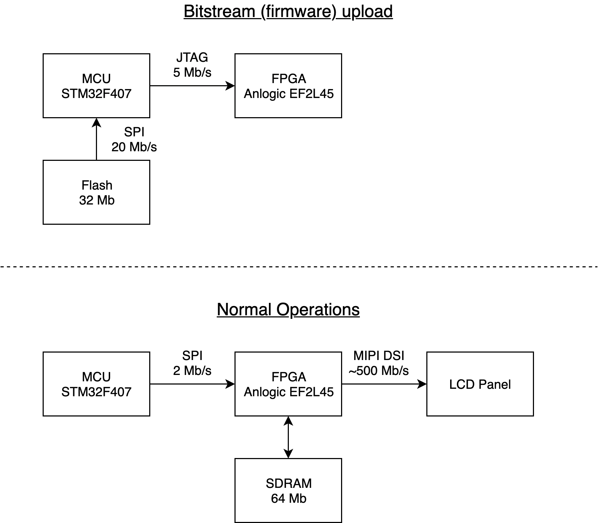

At boot time, the FPGA starts without its bitstream (its firmware). So the MCU
must program the FPGA before doing anything with it. This is different form the
Anycubic machine where the bitstream is flashed into the FPGA.

The bitstream is stored in the SPI flash at offset `0x79000`. It is sent via the
JTAG interface of the FPGA at boot time.

Once done, the FPGA is operable via a SPI interface. Unlike the Anycubic where
the data is sent pixel by pixel, the image format for the Saturn's FPGA is 7-bit
colors, RLE encoded, and it is sent at slower speeds. That means that sending
images with a lot of complexity can take a while on the Saturn.

The commands of the FPGA are the following:

Command | Description
--------|------------
`0x00`  | Show all black pixels on the LCD
`0x03`  | Not sure what that is, but the firmware does it
`0x04`  | Get the pixel resolution of the LCD
`0x08`  | Display the framebuffer contained in the RAM to the LCD
`0x10`  | Not sure, but the firmware does it before it starts drawing
`0x20`  | Not sure, but the firmware does it before it starts drawing
`0xfd`  | Start drawing: receive framebuffer data on the next bytes

Commands must be prefixed by `0xfe`. Replies from the FPGA are prefixed with
`0xfbfd`.

I haven't found any ways to set a palette, like the Anycubic, so quickly masking
a region on the LCD to do multiple exposure is not possible at this point. See
what I mean in the [previous part](../part9/README.md).

The image format that the FPGA accepts is a stream of bytes. Each byte is
interpreted in the following manner:
- If its high bit is set, then it means, draw a pixel of shade
  corresponding to the remaining 7 bits, with the following constraint:
  - The 3 highest values `0x7d`, `0x7e`, `0x7f` are forbidden. The original
  firmware transforms 7-bit gray scale colors with a scaling of `0x7c/0x7f` to
  make up for the missing 3 color shades.
- otherwise, the byte represents an integer `n` for which the display
  should repeat the previously drawn color pixel `n` times.
  The repeat has constraints:
  - The repeated pixels should never cross the column boundary of 0
  and 1920 pixels. This seems to suggest that the FPGA has two 1080p
  framebuffers stiched together.
  - `n` cannot be greater than `0x7d`. Looks like `0x7e` is also
  interpreted as a command prefix. `0x7f` seems to work, but the original
  firmware doesn't use it.

Also another interesting note, the framebuffer can only receive up to ~2.8MB of
compressed data. Pushing more than that and the display starts to look all
glitchy. That means that the lcd cannot display arbitrary images, and will only
tolerate highly compressible images (fortunately, 3d printing images are).

### Demo

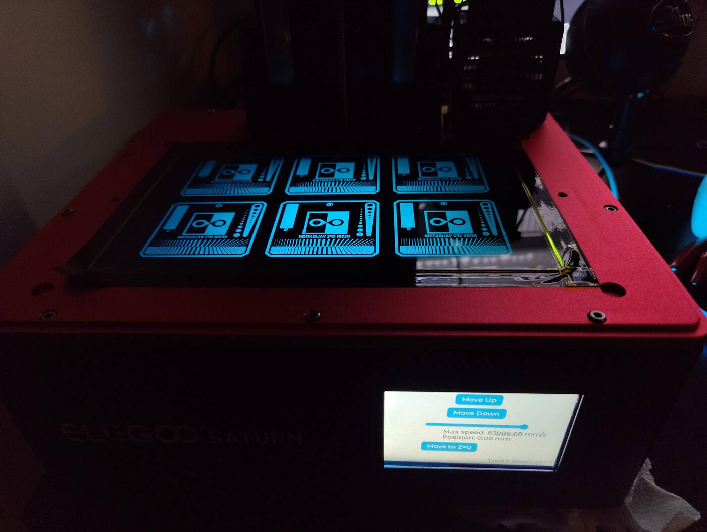

### The glitches

As discussed previously, there's two ways to get glitches:
1) Crossing the column at x=1080 (middle of the 4k lcd)
2) Having an image that is bigger than 2.8MB

You can see them both in action here:

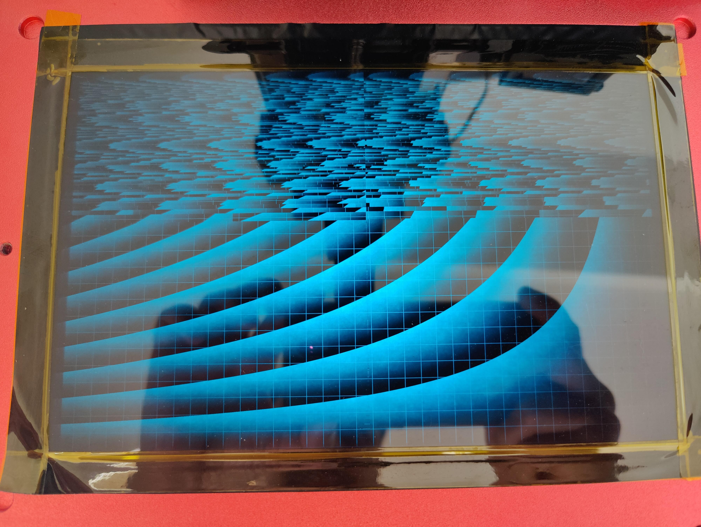

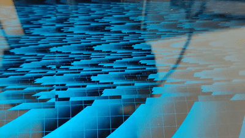

File formats
------------

A final note on file formats. I've implemented a parser for .ctb files, which
are the native saturn format. It required some strange "decryption". I took the
implementation from UVTools.

But interestingly, both printers Anycubic Mono 4K and Elegoo Saturn LCDs can
take any file format. In fact, Turbo Resin is able to use both file formats (.ctb
and .pwma) for both printers.

Another cool thing. We could use implement a .png or .bmp format for PCBs. It
would make lives of people easier that are trying to make PCBs:

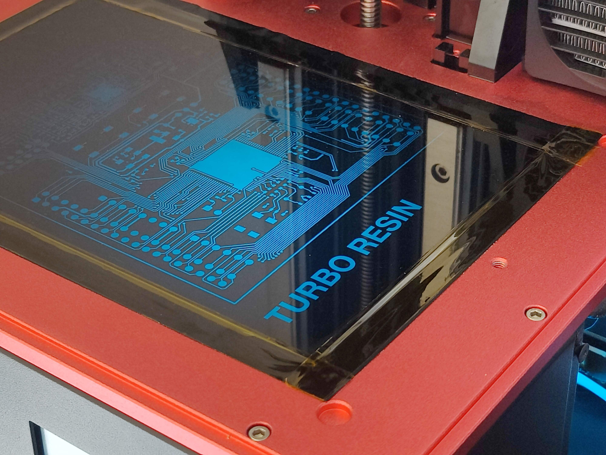

Emulating the firmware
-----------------------

### Introduction

My first thought was to figure out what external peripherals (like the
touchscreen) are connected to which pins on the microcontroller, just by
observing the firmware execution. This requires to monitor the internal
peripheral GPIO.

I quickly realized that I needed something like `strace` but for the firmware.
In other words, I'd like to execute the firmware and observe all of its interactions
with the microcontroller internal peripherals (like GPIO, SPI, I2C) to get an idea
of what it is doing. This involves monitoring and interpreting the accesses of
peripheral registers.

I didn't know how to achieve such monitoring with the embedded debugging
facilities of the microcontroller. It would involve setting read/write hardware
breakpoints on a large range of memory addresses. Besides, I didn't have the
hardware in my hands, and even if I did, it still a good idea to not rely on
having the real hardware. If we want to support many 3D printers, it's an
advantage to avoid relying on having the real hardware as my storage room is too
small for storing all the popular printers.

This led me to write an STM32 microcontroller emulator with support for
external devices (like displays, touchscreen, spi-flash). The idea is the
following:
* Download the Saturn (or any other printer) firmware from the official
website
* Run the emulator with the unmodified firmware
* Monitor the firmware and see its emulated display on the screen.

It's quite ambitious so I'm reducing the scope just enough to make it useful and
not turn it into a multi-year project.

There's some existing work in the STM32 emulation space:
* [Qiling](https://qiling.io/2022/04/14/intro/) emulates all kinds of devices,
  including STM32s. It would be a good candidate, but wasn't fitting the bill
  because 1) it's written in Python, and is very slow. 2) It doesn't support
  what I really want which is tracing in registers that I care about.
* [Renode](https://renode.io/): Emulate all sorts of devices, written in C#.
  The configuration files are finicky, and it's overall pretty slow. I didn't
  like it.
* [Tinylabs' flexsoc-cm3](https://github.com/tinylabs/flexsoc_cm3): This is
  Elliot's project to have the real stm32 peripherals to be accessible directly
  to a host that is emulating a CPU. I haven't tried it, but it looks promising.
* Use GDB and single step everything. That might be too slow.

### Emulator Features

Writing the emulator was hard but I didn't give up and kept going, so I
ended up with quite many features. The features are the following:
* The ARM instructions are emulated via Unicorn (a Qemu fork). We can register
  hooks on memory read/write given memory range. This gives us a way to provide
  implementations for all the internal peripherals as they are all accessible
  via memory mapped registers. For example, writing `1` to the address `0x40020014`
  means that the pin `PA0` should be driven to +3.3V.
* There are a lot of registers, precisely 1537 of them for the STM32F407.
  The emulator is configured via a [vendor provided SVD
  file](https://github.com/stm32-rs/stm32-rs-mmaps). This way, we can easily
  emulate many different STM32s without having to worry about peripheral
  register addresses. The emulator also uses that to display traces of all
  register accesses, useful for debugging the firmware.
* The following internal peripherals are implemented, some just partially:
  - Systick: Used by the firmware to schedule tasks, and perform long delays.
    (short delays are typically done with empty `for` loops doing lots of
    iterations).
  - RCC: Clocks configuration. The firmware waits for the PLLs to be ready, so
    we must give the illusion that some PLLs are ready.
  - USART: Sometimes, the firmware emits debug messages (printf), we can collect
    these messages on these devices and print it on stdout.
  - SPI: SPI peripherals are connected to various external devices. For example,
    both the Saturn and the Anycubic Mono X use the SPI interface for access
    their on-board 16MB SPI flash.
  - I2C: There's an EEPROM on board to store settings, like if the sound should
    be on or off, or the chosen language.
  - FSMC: Normally used for connecting external SDRAM chips, this is used for
    connecting the display as this peripheral makes it easy to output data on
    16 wires in parallel in a single instruction.
  - GPIO: We want to see all the pin input/output configurations and monitor
    all activity. That's a really important part of figuring out what the system
    does.
  - Software SPI: This is not a real internal peripheral. Sometimes, the
    firmware implements its own bit-banging SPI algorithm by manipulating the
    GPIO port directly  to communicate to various devices. For example, the
    Saturn uses software SPI with the FPGA, and the Mono X uses software SPI to
    communicate with its resistive touchscreen.
  - DMA: The Saturn firmware uses DMA to send data to USART
    peripherals at times. This means that instead of writing to the USART
    data register one byte at a time, it instructs the DMA
    engine to copy a memory region to the USART data register, byte after byte,
    allowing the CPU to go do something else.
  - NVIC a.k.a. the interrupt controller: The Unicorn engine does not handle
    interrupts. We need it, as the Saturn OS uses PENDSV interrupts to perform
    context switches between different execution threads. Here's what was
    involved with implementing the interrupt controller. Here's how it works:
    - After every single executed instruction, we check if there's a pending
      interrupt that should be triggered.
    - We push all the needed registers onto the stack. There's actually two
      different stacks on the ARM CPU. The master stack and the process stack.
      The one in use is indicated through the Control register. We must
      also push floating point registers if they are enabled.
    - Then we setup the LR register to a special value that will turn a regular
      function return instruction into a return from interrupt instruction.
      That special value encodes whether we are using the master or process
      stack.
    - Next, we setup the PC register to point to the correct interrupt vector
      address configured via the vector table located at `0x08000000`.
    - When the function returns, we read the LR register (modifiable by the
      firmware to switch from the master stack to the process stack) to unwind
      the interrupt stack correctly.
* Next, we have external devices that can be plugged into internal devices like
  USART, FSMC, I2C, software SPI, or directly on a specific GPIO pin. I have
  implemented a few:
  - SPI flash: Both the Saturn and Mono X use a SPI flash to store things like
    fonts and graphics for the display. Reads happen at the same time as writes
    (full-duplex), making the implementation a big streaming state machine.
    There were challenging details such as supporting the SPI peripheral in both
    8-bit and 16-bit mode, and having everything configurable via a config file.
  - TFT display: This emulates an ILI9341 TFT display controller.
    firmware can instruct commands like "The following data is the pixel data
    to fill this (x1,y1,x2,y2) rectangle".  The pixel data can be configured to
    go in two different framebuffers:
    - A PNG file on disk, written after the emulation is stopped
    - A live window showing in real time the content of the display. This is
      implemented using the SDL2 library. I thought it would be a good idea
      to use this one because it's used for video games and other performance
      sensitive applications.
  - Touch screen: This emulates an ADS7846 resistive touch screen. There's
    various commands to handle, like MeasureX, MeasureY, MeasureZ (pressure),
    which can be configured to be read in either 8 or 12 bits precision.
    The Mono X relies on a separate GPIO pin to indicate when the display
    detects a touch. Implementing this was important otherwise, it would ignore
    the touch screen.
  - LCD panel: We emulate the FPGA driving the LCD panel. It decodes and sends
    the pixel data to a framebuffer similarly to the TFT display.
* The emulated system is configurable through a yaml file. See example below.
* Despite all the things we are doing, the emulator is reasonably fast. On my
  laptop, the emulator is able to run on at around 50Mhz. That's 1/3 of the real
  speed. That's much faster than the other emulators which are at least 10x
  slower, if not more.

The emulator source code can be found on
[github.com/nviennot/stm32-emulator](https://github.com/nviennot/stm32-emulator).

### Emulating the Elegoo Saturn

In the [configuration file](https://github.com/nviennot/stm32-emulator/blob/main/saturn/config.yaml),
we provide an SVD file that provides all the peripheral register addresses for
the STM32F407. We then configure various memory regions, framebuffers, and
devices. We also patch two functions in the firmware just to speed things up as
we don't need to wait for our devices to initialize.

We also specify the firmware binary `saturn-v4.4.3-pj-v5.bin`, and that's the
official binary downloaded from the Elegoo website.  The `ext-flash.bin` is the
content of the external SPI flash dumped from the Saturn board itself (I cheated
a bit here, I wish we could have just used the downloaded version, it wasn't
working, and I was in a hurry).

#### Youtube demo

[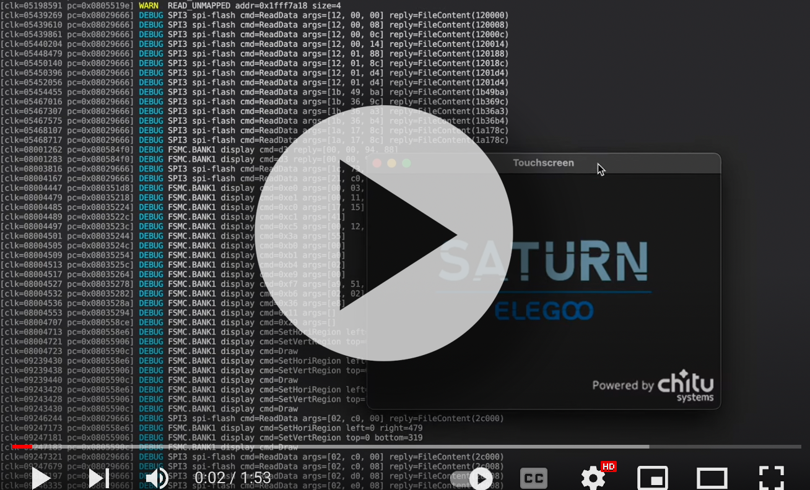](https://www.youtube.com/watch?v=Uc8eq4JsJyM)

#### Try it out

```
$ git clone https://github.com/nviennot/stm32-emulator.git
$ cd stm32-emulator/saturn
$ cargo run --release -- config.yaml -v
```

#### The output

On the following we see some of the output.
We can see how the firmware initialize the display for example. These are
display commands we need to reproduce when implementing our own firmware.
We can also see that it's emitting something on the UART.
We also see its interaction with the SPI Flash.

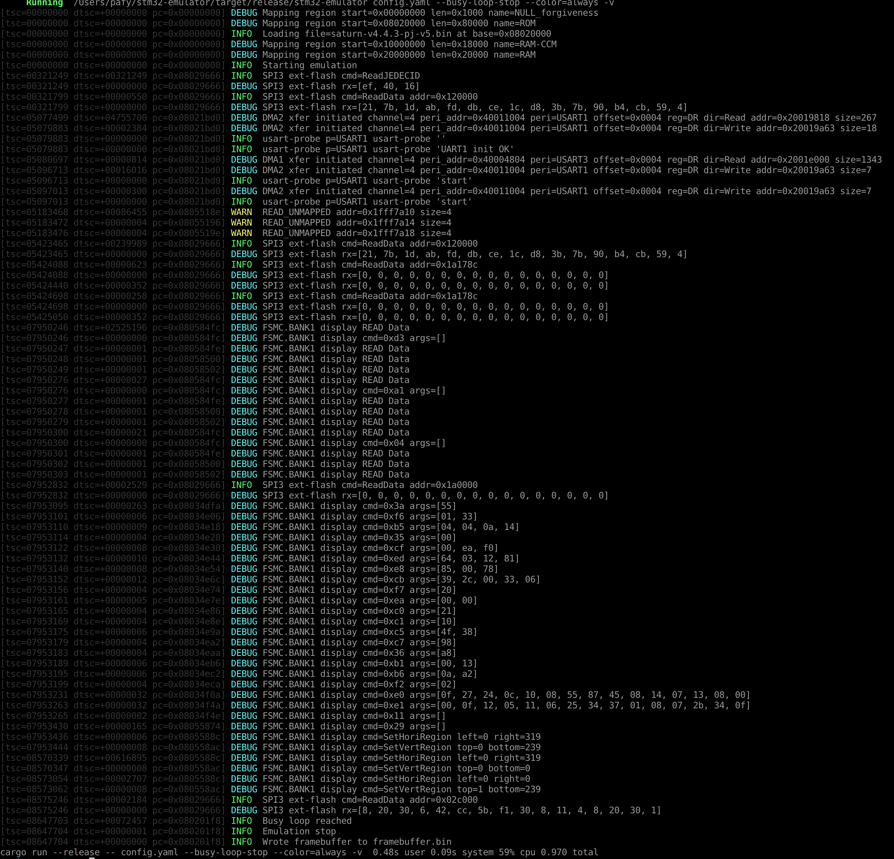

We can also see that the firmware has issues. The init routines are messy from
what I've seen in the decompilation. In the emulation, we can see NULL pointer
exceptions, GPIO being re-configured multiple times.
On the STM32, address 0 is actually mapped to the flash, and so the memory
accesses in the first 4K don't actually fail, so failures of this nature go
silent.

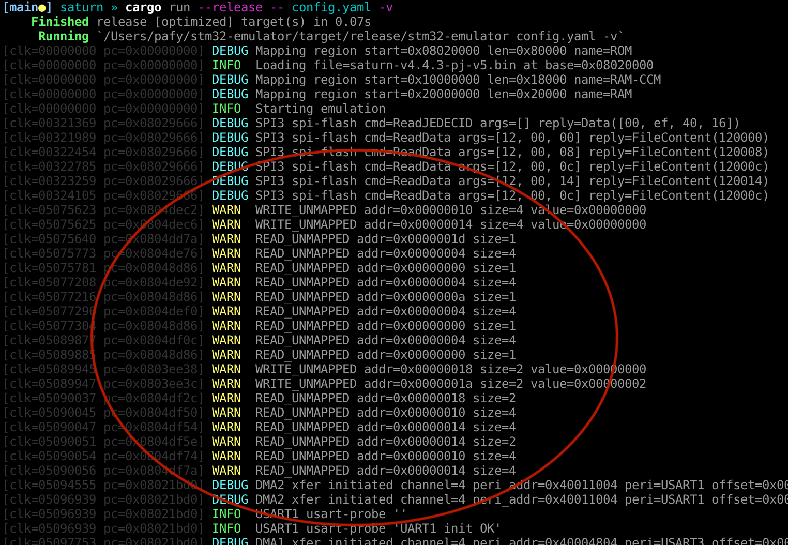

We can see how the GPIOs are getting configured:

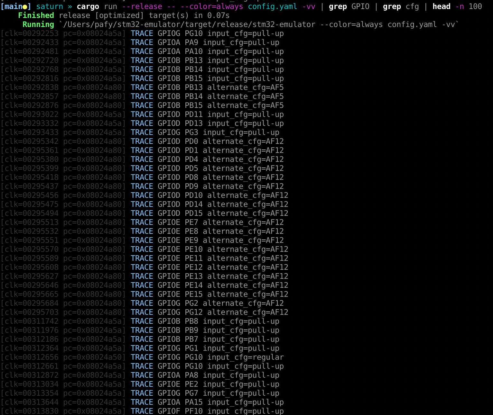

We can see how a specific peripheral gets initialized, like SPI2. That
information is coming right off the SVD file.

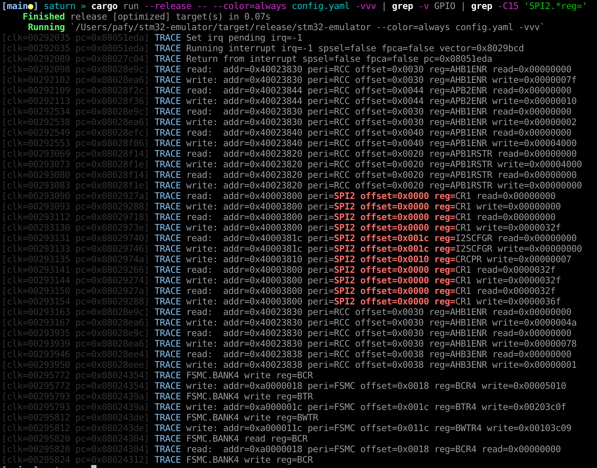

We can also do instruction tracing with `-vvvv`:

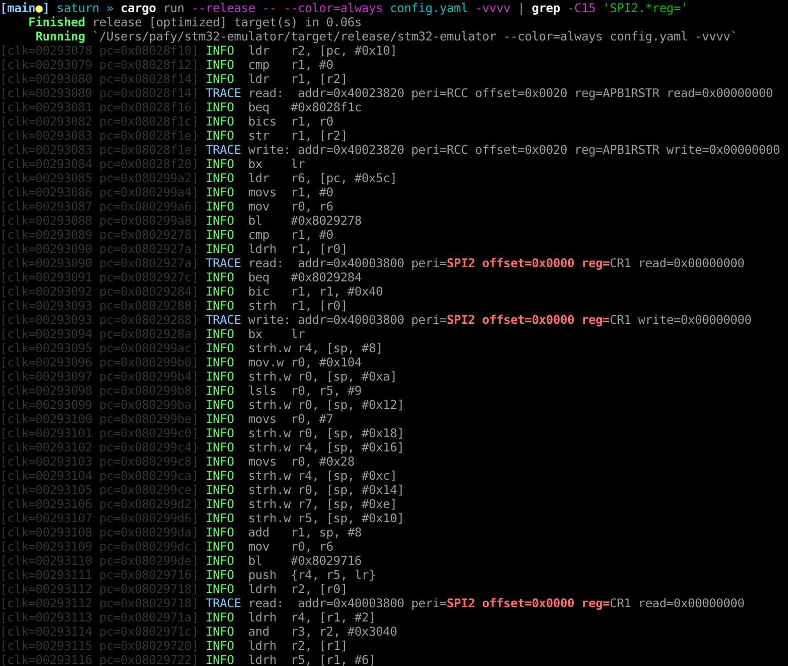

Overall, the emulator is useful to understand what the firmware is doing without
having the real printer on hand, which will be helpful in supporting additional
printers for TurboResin.

It would be fun to implement a GDB server provided by the emulator, this way we
could use GDB to inspect the runtime, and even connect a decompiler like Ghirda
or IDA Pro.

### Emulating the Anycubic Mono X

As a bonus, we can emulate the Mono X, as the emulator is generic:

#### Youtube demo

[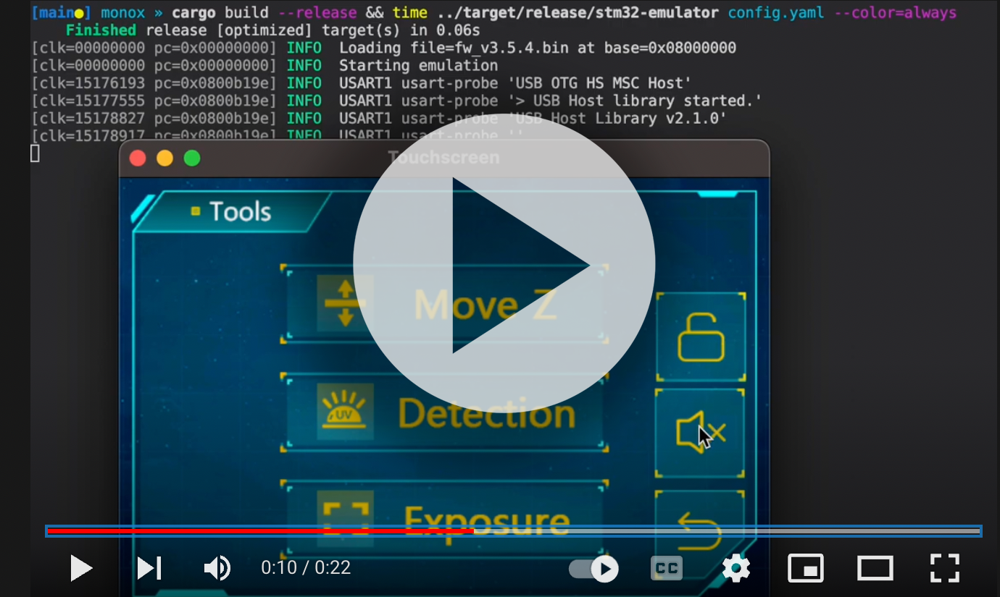](https://www.youtube.com/watch?v=VyB3ru0u4Go)

#### Try it out

```
$ git clone https://github.com/nviennot/stm32-emulator.git
$ cd stm32-emulator/monox
$ cargo run --release -- config.yaml -v
```

Conclusion
-----------

With all this, I'm able to support the Elegoo Saturn in [Turbo
Resin](https://github.com/nviennot/turbo-resin).

Next step is to do a full print with the custom firmware.

You can:
* Check out the [Turbo Resin Github page](https://github.com/nviennot/turbo-resin/)
  project. This is where all the source code is located.
* Join our discord channel: https://discord.gg/9HSMNYxPAM
* Sponsor the project: https://github.com/sponsors/nviennot
* Learn the Rust programming language, and contribute some code

If you have ideas that you'd like to contribute, please come and share them!

Nico
