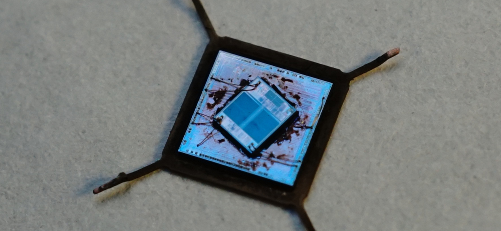
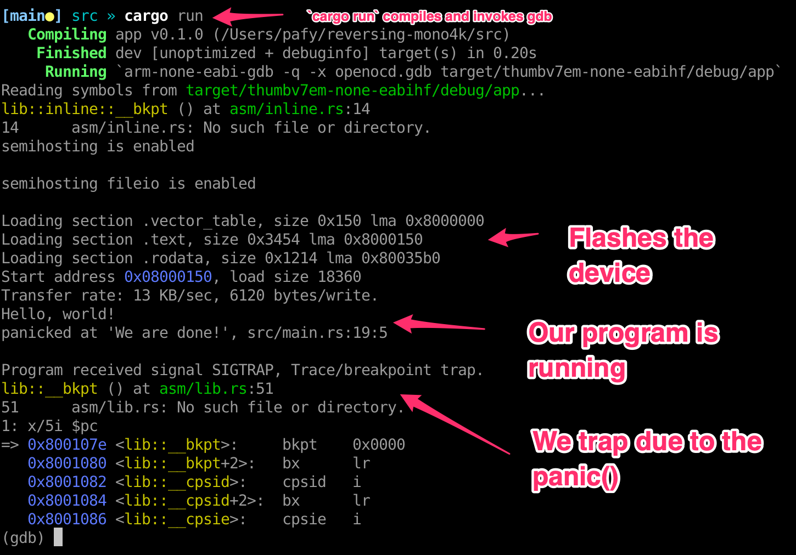

Part 3: Creating a Rust development environment
===============================================

In the [previous part](../part2/README.md), if we don't want to desolder the
flash chip, or add a flash reader directly to the board, we are going to have to
write some code and run it on the MCU.

## Introduction

[The Rust embedded book](https://docs.rust-embedded.org/book/) tells us a little
bit what kind of code structure is expected:
* First, we have a device crate (a crate is a Rust dependency). It defines where
  the peripheral registers are located, provides meaning to all the register
  bits, including which ones are read-only, write-only, etc. It's a bit like the
  transcription of the device family user manual into code.
  You can see [the device crates](https://github.com/rust-embedded/awesome-embedded-rust#peripheral-access-crates).
* Second, we have a Hardware Abstraction Layer (HAL). This is meant to abstract
  away the details of the device registers to provide a generic API. It's useful
  for various reasons. Once we write our code against this HAL API, we get the
  ability to swap devices easily without having to rewrite our code. Making our
  firmware compatible with other boards will be easier. Another reason is to
  provide safety in the use of the device resources. For example, once a pin is
  configured as an input, it cannot be misused as an output.
  You can see the [HAL crates](https://github.com/rust-embedded/awesome-embedded-rust#hal-implementation-crates)
* Third, we can have device drivers controlling various on-board peripherals.
  For example, a stepper motor driver, or a SPI flash driver. These would be
  useful for our use-case. You can see some of these
  [drivers](https://github.com/rust-embedded/awesome-embedded-rust#driver-crates)
* Lastly, our application code that glues everything together. We may or may
  not use a real-time operating system. We'll see.

### The bad news

There's no support for the GD32F307 chip. We're going to have to create the
support.

### The good news

We can automate the creation of the device crate via SVD files, which I'll get
to in a bit. Also, the STM32 chip family registers resembles to the ones in our
chip, so hopefully we can copy/paste a bunch of code from the HAL layer if
the hardware designers didn't get too creative in implementing peripherals. Bugs
are expected, and long debugging sessions are coming, no doubt.

There's a device create for our device family
[`gd32-rs`](https://github.com/qwandor/gd32-rs), and a
[`gd32f1x0-hal`](https://github.com/qwandor/gd32f1x0-hal) crate. These are good
starting points.

*NOTE from the future*: Using the `stm32f1xx-hal` crate is better. See in [Part 4](../part4/README.md).

## Creating the device crate

Manufacturers provide support for various development environments. To make
things easier, vendors typically provide a SVD file (System View Description)
that formally describes the hardware. The detail contained in system view
descriptions is comparable to the data in device reference manuals.  The
information ranges from high level functional descriptions of a peripheral all
the way down to the definition and purpose of an individual bit field in a
memory mapped register.

On the [download page of gd32mcu.com](http://www.gd32mcu.com/en/download),
we can find `GD32F30x Firmware Library`. In there, we can find files for the arm
Keil IDE to support the GD32F30x family of product.  There's one file called
`GigaDevice.GD32F30x_DFP.2.1.0.pack` which is a zipfile.

Devices are described in `GigaDevice.GD32F30x_DFP.pdsc`. This file describes the
flash/memory layout for each device, as well as the corresponding SVD file.
Here's an extract from `GD32F30x_CL.svd`. It's a fairly verbose XML file
weighing a whooping 1.3MB.

```xml
...
<peripheral>
  <name>GPIOA</name>
  <description>General-purpose I/Os</description>
  <groupName>GPIO</groupName>
  <baseAddress>0x40010800</baseAddress>
  <addressBlock>
    <offset>0x0</offset>
    <size>0x400</size>
    <usage>registers</usage>
  </addressBlock>
  <registers>
    <register>
      <name>CTL0</name>
      <displayName>CTL0</displayName>
      <description>port control register 0</description>
      <addressOffset>0x0</addressOffset>
      <size>0x20</size>
      <access>read-write</access>
      <resetValue>0x44444444</resetValue>
      <fields>
        <field>
          <name>CTL7</name>
          <description>Port x configuration bits (x=7)</description>
          <bitOffset>30</bitOffset>
          <bitWidth>2</bitWidth>
        </field>
        <field> <name>MD7</name>
          <description>Port x mode bits (x=7)</description>
          <bitOffset>28</bitOffset>
          <bitWidth>2</bitWidth>
        </field>
...
```

It is customary to use the vendor provided SVD file to generate the device crate
using [`svd2rust`](https://github.com/rust-embedded/svd2rust). I can add the
support for our device in the `gd32-rs` crate. Here's the
[commit](https://github.com/nviennot/gd32-rs/commit/a525c52ecd127031c014370a5b3de138dd255cb6).
I'll make a pull-request later once I test this thing a little.

## Bootstrapping the Rust firmware source code

[The Rust embedded book](https://docs.rust-embedded.org/book/) points to the
[`cortex-m-quickstart`](https://github.com/rust-embedded/cortex-m-quickstart)
repository which I'm going to use as a template for this project.

There are a couple of steps that are different from a regular Rust project.

### Installing the target toolchain

We are told to install the toolchain and helpful tools, no problem.

```
rustup target add thumbv7em-none-eabihf
rustup component add llvm-tools-preview
cargo install cargo-binutils
cargo install cargo-generate
brew install armmbed/formulae/arm-none-eabi-gcc
brew install qemu
```

Here, I'm using the brew package manager, but the Rust book has you covered if you are
using Linux or Windows.

QEMU is not really needed, it could be nice to run the firmware emulated on the
computer. This might not work well as there's not really a good emulator for our
specific chip.

### `Cargo.toml` dependencies

We must configure the project dependencies via `Cargo.toml`. Here's what I've
got so far:

```toml
[dependencies]
cortex-m = "0.7"
cortex-m-rt = "0.7"
cortex-m-semihosting = "0.3"
panic-semihosting = "0.5"
panic-halt = "0.2"
gd32f3 = { path = "../gd32-rs/gd32f3", features = ["gd32f307", "rt"]}
```

We have no HAL at this point, but this is enough to get us started. the `rt`
feature means that we want access to interrupts. It will be useful for later.
Also note that I'm overriding `path` of the dependency `gd32f3` as I'm working
with a local copy.

The `cortex-m-*` crates provides access to CPU configuration registers. The
`panic` crates provides behavior for what to do when our program panics.
The `semihosting` crates are for the MCU to communicate with a host via a debug
channel (here OpenOCD + GDB), we'll get to it.

*NOTE from the future*: Using the `stm32f1xx-hal` crate is better. See in [Part 4](../part4/README.md).

### Memory layout

Next, we configure our device memory layout in `memory.x`.
The flash on the GD32F307 is 512K, in two different banks of 256KB.  The first
bank has pages of 2KB, and the second bank 4KB.  There are delays when the CPU
executes instructions from the second bank.  Let's ignore the second bank for
now. The values here are found in the datasheet of the device.

```
MEMORY
{
  FLASH : ORIGIN = 0x08000000, LENGTH = 256K
  RAM : ORIGIN = 0x20000000, LENGTH = 96K
}
```

It's fairly straight forward, I like it!

### Cargo configuration

In `.cargo/config.toml`, we specify what `cargo run` does. We want to flash the
target, and run the program.

```
[target.'cfg(all(target_arch = "arm", target_os = "none"))']
runner = "arm-none-eabi-gdb -q -x openocd.gdb"

[build]
target = "thumbv7em-none-eabihf" # Cortex-M4F and Cortex-M7F (with FPU)
```

Here we use gdb with an init script `openocd.gdb` for `cargo run`, and tell the
compiler to target a Cortex-M4 with a floating point unit.

### OpenOCD + gdb configuration

OpenOCD doesn't have official support for the `GD32F307`, and we need a way to
flash our soon to be compiled program in the internal flash of the chip.

It turns out that the `GD32F307` flash driver behaves the same way as the `STM32F1X`
device families. (Same register addresses). It appears that the `GD32` product
line is a clone of the `STM32` product line. See this
[hackaday article](https://hackaday.com/2020/10/22/stm32-clones-the-good-the-bad-and-the-ugly/)
and this [GD32 decap](https://zeptobars.com/en/read/GD32F103CBT6-mcm-serial-flash-Giga-Devices).
This could make our lives easier as we can copy/paste parts of the STM32 driver
code. It's not an exact copy. Figuring out what are the differences will most likely
be tedious.


Photo from [zeptobars](https://zeptobars.com/en/read/GD32F103CBT6-mcm-serial-flash-Giga-Devices)

Look at these animals. This chip is a huge hack (the same could be said for
any useful system). But hey, it works fine apparently. A notable difference is
that the `GD32F307` takes a little longer to boot (the Flash content must be
copied to RAM on boot), and the device can run faster.

For now, here's the OpenOCD command that works with my JLink probe

```
# Using the Jlink adapter in SWD mode (not JTAG), and pretend we are talking to
# a STM32F1X device. That target file comes with openocd.
openocd -c 'adapter driver jlink; transport select swd' -f target/stm32f1x.cfg

Info : Listening on port 6666 for tcl connections
Info : Listening on port 4444 for telnet connections
Info : J-Link V10 compiled Nov  2 2021 12:14:50
Info : Hardware version: 10.10
Info : VTarget = 3.300 V
Info : clock speed 1000 kHz
Info : SWD DPIDR 0x2ba01477
Info : stm32f1x.cpu: hardware has 6 breakpoints, 4 watchpoints
Info : starting gdb server for stm32f1x.cpu on 3333
Info : Listening on port 3333 for gdb connections
```

The final part is to plug `gdb` to `openocd`. Here's its configuration file:

```
# Connect to OpenOCD
target extended-remote :3333

# Enable OpenOCD's semihosting capability
monitor arm semihosting enable
monitor arm semihosting_fileio enable

# Set backtrace limit to not have infinite backtrace loops
set backtrace limit 32

# Print demangled symbols
set print asm-demangle on

# Print 5 instructions every time we break.
# Note that `layout asm` is also pretty good, but my up arrow doesn't work
# anymore in this mode, so I prefer display/5i.
display/5i $pc

# Write our program into the device's internal flash
load

# Resume execution
continue
```

GDB is the one loading the ELF file produced by `cargo build`, and directing
`OpenOCD` to write its content to the correct location via the `load` command.


### `src/main.rs`

Our hello world  program:


```rust
#![no_std]
#![no_main]

use panic_semihosting as _; // logs messages to the host stderr; requires a debugger

use cortex_m_rt::entry;
use cortex_m_semihosting::hprintln;

use gd32f3::gd32f307;

#[entry]
fn main() -> ! {
    hprintln!("Hello, world!");
    panic!("We are done!");
}
```

When we do `cargo run`, here's what we get:



And there we have it. We are running our own code on the Mono 4K's controller
board. This took me a while to get right. I originally had a mistake in
`memory.x`, and nothing was getting written to the flash.

We can use `hprintln!()` to show messages on our terminal like a `printf()`
statement, and when the program panics, we get a message, nice. This is using
the semihosting features of the Arm CPU which are essentially system calls
issued to the host (the debugger). We'll dive into these facilities in the next
part to see how we can use this to send a large binary (like the external
flash that we are after).

Next, we'll be dumping the content of the flash chip.

[Go to Part 4](../part4/README.md)
