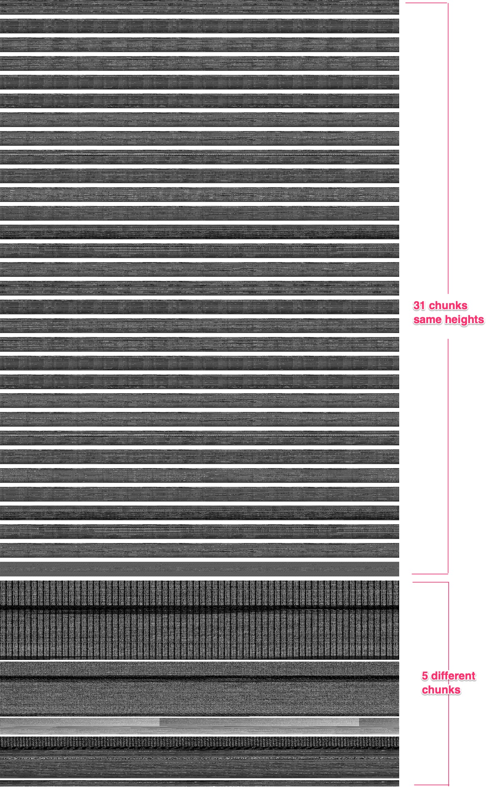
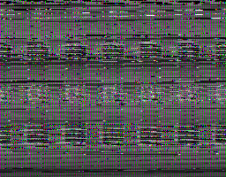
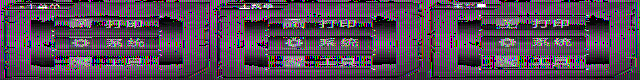
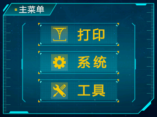
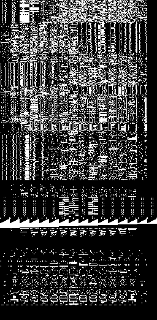
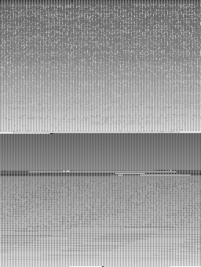
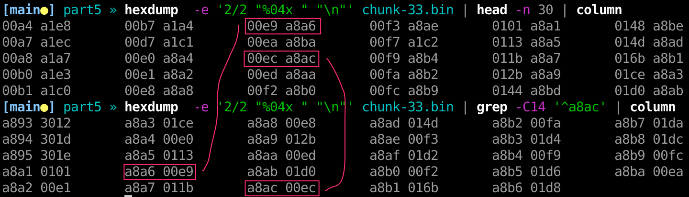
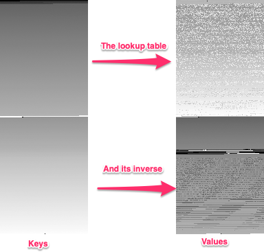
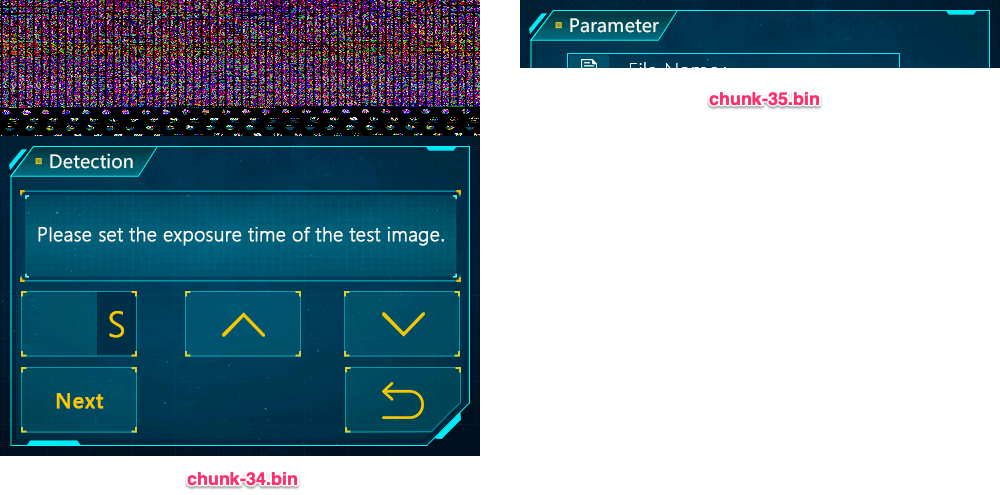

Part 5: Graphics extraction from the external ROM
=================================================

In the [previous part](../part4/README.md), we managed to extract the content of
the external flash on the board. We obainted a 16MB
[`ext.bin`](/firmware/ext.bin) binary.

How do we dissect it? The first thing I tried was using
[binwalk](https://www.kali.org/tools/binwalk/), but that didn't yield any
result. Note that I'm expecting graphical elements because 1) Firmware updates
contain can a UI file (see on [chitu
website](https://shop.chitusystems.com/download/)), and 2) I've used the
machine, there are a bunch of diffrent UI screens. The graphics have to be somewhere

We can look at the binary visually. This time, instead of using
[binvis](https://binvis.io/), we'll use our good old friend,
[ImageMagick](https://imagemagick.org/script/command-line-options.php).
It's a command line tool to manipulate images, and we'll be using it
extensively in this section.

Let's look at this binary as a 8bit (1 byte) gray scale square image. I'm
picking a size of `4096*4096*1 = 16MB`. We typically always want to have
`X*Y*bytes_per_pixel = file_size`. Because we picked a `bytes_per_pixel = 1`,
gray scale, each byte of the file is represented as a pixel which brightness is
the byte value (0 is black, 255 is white). The image is constructed like we
would construct a text page, with a stream letters: line by line, left to right,
top to bottom.

```bash
convert -size 4096x4096 -depth 8 GRAY:ext.bin ext.png
```

Only the first half (the first 8MB of the binary) of the image contains
non-white pixels. Here they are:



We observe 31 chunks of data of the same size, and 5 other chunks of different
sizes. All are separated with white pixels (`0xff` in the binary).

## Extracting the chunks

Let's extract each chunk and work with them separately. A python script
will do. We'll use regular expression! (weird, right?)

```python
ext_bin = open('ext.bin', 'rb').read()
for (i, chunk) in enumerate(re.split(b'\xff{1024,}', ext_bin)):
    with open(f"chunk-{i:02}.bin", 'wb') as fout:
        fout.write(chunk)
```

Essentially, we read the binary in memory and get a byte buffer (it's like a
string, but not UTF8, just bytes). And then do a `split()` on that (long) string
of bytes over `'\xff{1024,}'`. This means at _least 1KB of white pixels_.

Et voila:

```bash
chunks » ls -l
total 13512
-rw-r--r--  1 pafy  staff  153600 Jan  9 01:40 chunk-00.bin
-rw-r--r--  1 pafy  staff  153600 Jan  9 01:40 chunk-01.bin
...............................................chunk-XX.bin
-rw-r--r--  1 pafy  staff  153600 Jan  9 01:40 chunk-29.bin
-rw-r--r--  1 pafy  staff  153600 Jan  9 01:40 chunk-30.bin

-rw-r--r--  1 pafy  staff  831744 Jan  9 01:40 chunk-31.bin
-rw-r--r--  1 pafy  staff  574720 Jan  9 01:40 chunk-32.bin
-rw-r--r--  1 pafy  staff  174592 Jan  9 01:40 chunk-33.bin
-rw-r--r--  1 pafy  staff  438272 Jan  9 01:40 chunk-34.bin
-rw-r--r--  1 pafy  staff   65536 Jan  9 01:40 chunk-35.bin
```

## Decoding the first 31 chunks

Let's throw a guess at the image format. We are expecting a color image, so 3
bytes per pixel (RGB), rectangular shape with an aspect ratio of 5:4 (like the
touch screen, roughly). The file size is `153600`. Let's try something, like
`256*200*3 = 153600`.

```bash
convert -size 256x200 -depth 8 RGB:chunk-00.bin try1.png
```



Okay, not good. There's some faint patterns. Maybe the size is not just right.
Let's bruteforce sizing. We can because we assume that all the bytes from the
file must be used, and so there's only a few image dimentions that'll work.

```python
file_size = 153600
num_pixels = file_size/3 # /3 because RGB
for x in range(100, 1000):
    if num_pixels % x == 0:
        y = int(num_pixels / x)
        print(f"{x}x{y}")
```

This program gives us the following sizes to try: `100x512`, `128x400`,
`160x320`, `200x256`, `256x200`, `320x160`, `400x128`, `512x100`, `640x80`,
`800x64`.

Among all these sizes, only `640x80` is giving us something a little better:



I can distinguish the main menu if I squint sufficiently.
After some more unsuccessful trial and error, it's time to revisit our initial
assumption. Maybe the pixel format is not 8 bit per channel. After all, we are
in a size constrained environment.

Let's poke in the middle of the file:

```
» hexdump -s 50000 -C chunk-00.bin | head
0000c350  eb 01 cb 01 ca 01 cb 01  ca 01 d5 04 b5 04 2c 02  |..............,.|
0000c360  2c 02 2c 02 2c 02 4c 02  4c 02 2c 02 2c 02 2c 02  |,.,.,.L.L.,.,.,.|
0000c370  2c 02 2c 02 2c 02 2c 02  2c 02 4c 02 4c 02 4c 02  |,.,.,.,.,.L.L.L.|
0000c380  4c 02 4c 02 4c 02 4c 02  4c 02 4c 02 4c 02 4c 02  |L.L.L.L.L.L.L.L.|
0000c390  4c 02 2c 02 4d 02 4d 02  4c 02 4c 02 2c 02 4c 02  |L.,.M.M.L.L.,.L.|
0000c3a0  4c 02 4d 02 ef 02 0f 03  0f 03 30 03 30 03 0f 03  |L.M.......0.0...|
```

In an image, most neighbouring pixels are similar. So we should be able to see
some patterns to recognize the pixel format. Do you see them? It looks like
group of two bytes are repeated.

Splitting 2 bytes (16 bits) in 3 channels (RGB) is tricky so let's punt on the
color, and look at the binary as a 16 bits grayscale image.
There's 20 dimensions for which we can solve `x*y*2 = 153600`. One
of them work well, `320x240`:

```bash
convert -size 320x240 -depth 16 GRAY:chunk-00.bin try3.png
```


This look good! Now what about the color? `16/3 = 5.333` bits per RGB channel.
Either we could have 5 bits per channel, but that would be wasting 1 bit.
Turns out, there a way to pack 3 channels (RGB) into 16 bits:
[RGB565](https://en.wikipedia.org/wiki/High_color#16-bit_high_color). Let's try
that! The green channel gets the extra bit because humans are more sensitive to
the green channel. Camera sensors have typically twice the number of green
pixels than red and blue ones.

```bash
convert -size 320x240 RGB565:chunk-00.bin try4.png
```



Check this out! We got it right! We can generate all the other images and tile
them.

```bash
for i in `seq -w 0 30`; do convert -size 320x240 RGB565:chunk-$i.bin ui-$i.png; done
# -geometry +0+0 means we don't want any separation between tiles
# -tiles 5x so we have 5 tiles on the x axis.
montage -background none -label %f ui-* -geometry +5+5 -tile 5x ui.png
```


There 15 different UI screens per language (chinese and english). The last image
is the boot splash image.

Note that each image starts at the offset `i*0x30000` in the ROM, `i` being the
index of the image.

## Decoding `chunk-31.bin`

This chunk is the first of the irregular ones. Its file size is `831744`.
I tried a few pixel depths, sizes, and wasn't getting much success, until
I tried a really narrow size of `256x25992` with 1 bit per pixel:



We can see some something across and 16 bands. This tells me to try using an X
resolution of `256/16 = 16px`.

```bash
# Note the '[0]' to avoid ImageMagick to output lots of files.
# As we are using a small Y=200 size (instead of Y=415872px)
convert -size 16x400 -depth 1 GRAY:chunk-31.bin'[0]' try6.png
```


It's the chinese character font!

Notice the 5th character from the bottom, it's vertically flipped (not that my
chinese is any good, but I can recognize a few characters). We can use the
`-flop` option of ImageMagick.

```
convert -size 16x300 -depth 1 GRAY:chunk-31.bin'[0]' -rotate 90 -flop try7.png
```


There we go. Each character is 16x16 in size, 1 bit per pixel. So 16 bytes per
character.  The font has **51,984** characters! Massive!

ImageMagick can be used to generate an image of the whole font:

```
montage -size 16x16 -depth 1 GRAY:chunk-31.bin -rotate 90 -flop -geometry +0+0
-tile 190x font1.png
```


## Decoding `chunk-32.bin`

Same command as for the previous chunk. It's another font, but this time as a
12x12 font.

```bash
montage -size 16x12 -depth 1 GRAY:chunk-32.bin'[0-23939]' -rotate 90 -flop -crop
12x12+0+0 -geometry +0+0 -tile 190x font2.png
```


## Decoding `chunk-33.bin`

This files of 174592 bytes contains a bunch of 16bits values. Here's an image
representation.

```bash
convert -size 256x341 -depth 16 GRAY:chunk-33.bin chunk-33.png
```


This one doesn't appear to contain graphics. It looks like a `(key:u16,
value:u16)`lookup table. Interestingly, if we find the pair `(key, value)`, we
find `(value, key)` somewhere in the file. Look:



We can have an image representation of the keys and values ith image magick with some obscure command
line:

```bash
convert -size 256x341 -depth 16 GRAY:chunk-33.bin -sample 50%x100% chunk-33-a.png
convert -size 256x341 -depth 16 GRAY:chunk-33.bin -define sample:offset=100 -sample 50%x100% chunk-33-b.png
```



This whole lookup table describes a permutation and its inverse.

[Marijn van der Werf (@marijnvdwerf)](https://github.com/marijnvdwerf) figured
out its meaning. It's to convert UTF8 codepoints to
[GB18030](https://encoding.spec.whatwg.org/gb18030.html) and vise versa.
It's useful because the program has UTF8 chinese strings that needs to be
displayed using the fonts organized in the GB18030 format.

By the way, a tool I find really useful when trying different image
interpretation is VSCode. It automatically reloads the image that is opened in a
tab whenever it changes, even when the window is not in focus, and it keeps the
zoom factor when it reloads the image.

## Decoding `chunk-34.bin` and `chunk-35.bin`

```bash
convert -size 480x456 RGB565:<(tail -c +513 chunk-34.bin) chunk-34.png
convert -size 480x68 RGB565:chunk-35.bin'[0]' chunk-35.png
```



The first part of chunk-34 looks like a font, but I'm not sure how to decode it.

Then we have junk because there's no `480x320` display on this machine. Our
touchscreen resulution is `320x240`. @marijnvdwerf discovered that these images
are contained in the [Mono
SE](https://www.anycubic.com/products/photon-mono-se-lcd-3d-printer) firmware.
This junk data can be found in the Mono SE UI firmware file at the exact same
offset.  I'm not sure how these leftovers made it on the Mono 4K. Maybe the
engineers were in a hurry and dumped the ROM of the development board used for
multiple machines onto the production machines.

But we can conclude that the Mono 4K firmware is most likely based on the
Mono SE firmware. This means that the FPGA firmware that can be downloaded is
likely to be very similar to what is on the board of the Mono 4K.

All the individual UI images can be found in [/firmware/ui](/firmware/ui)

Next, we are going to interface with the touch screen.

[Go to Part 6](../part6/README.md)
