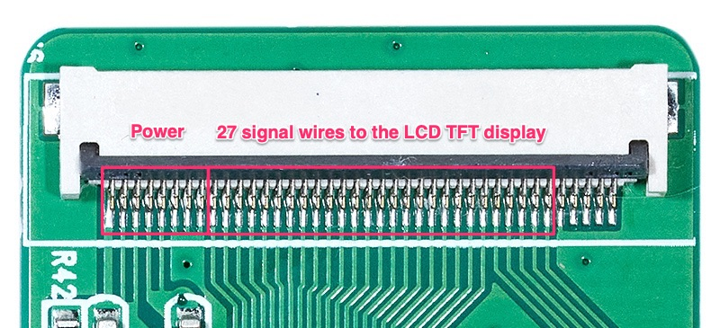
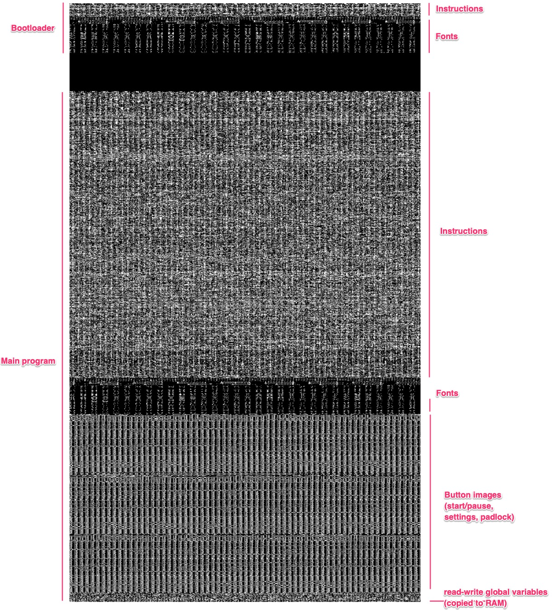
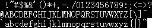
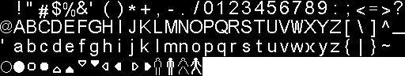
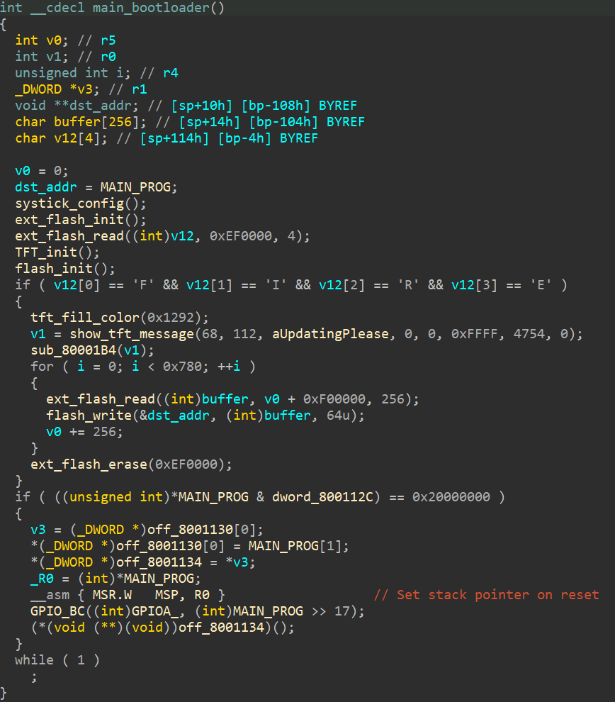
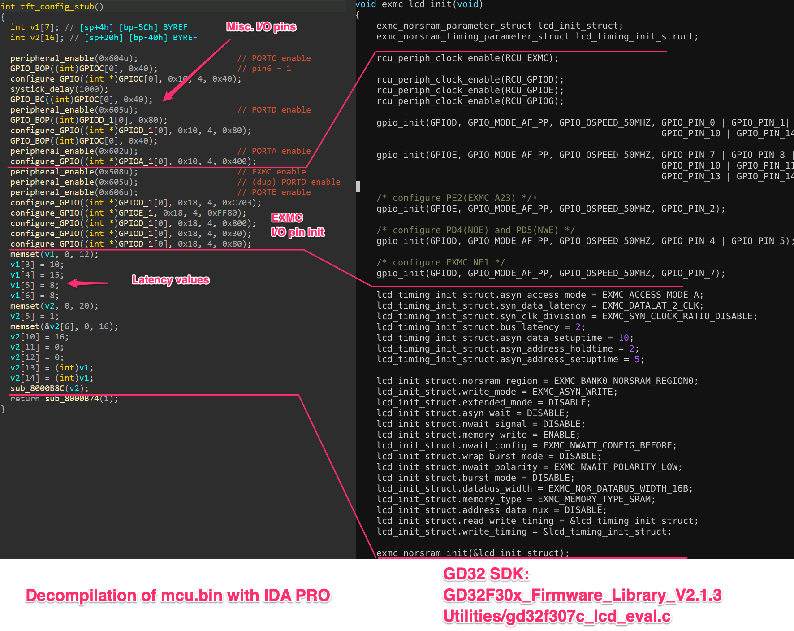
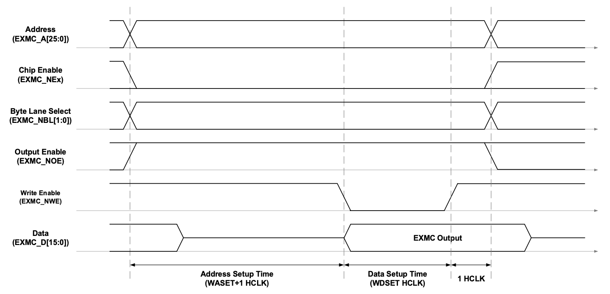
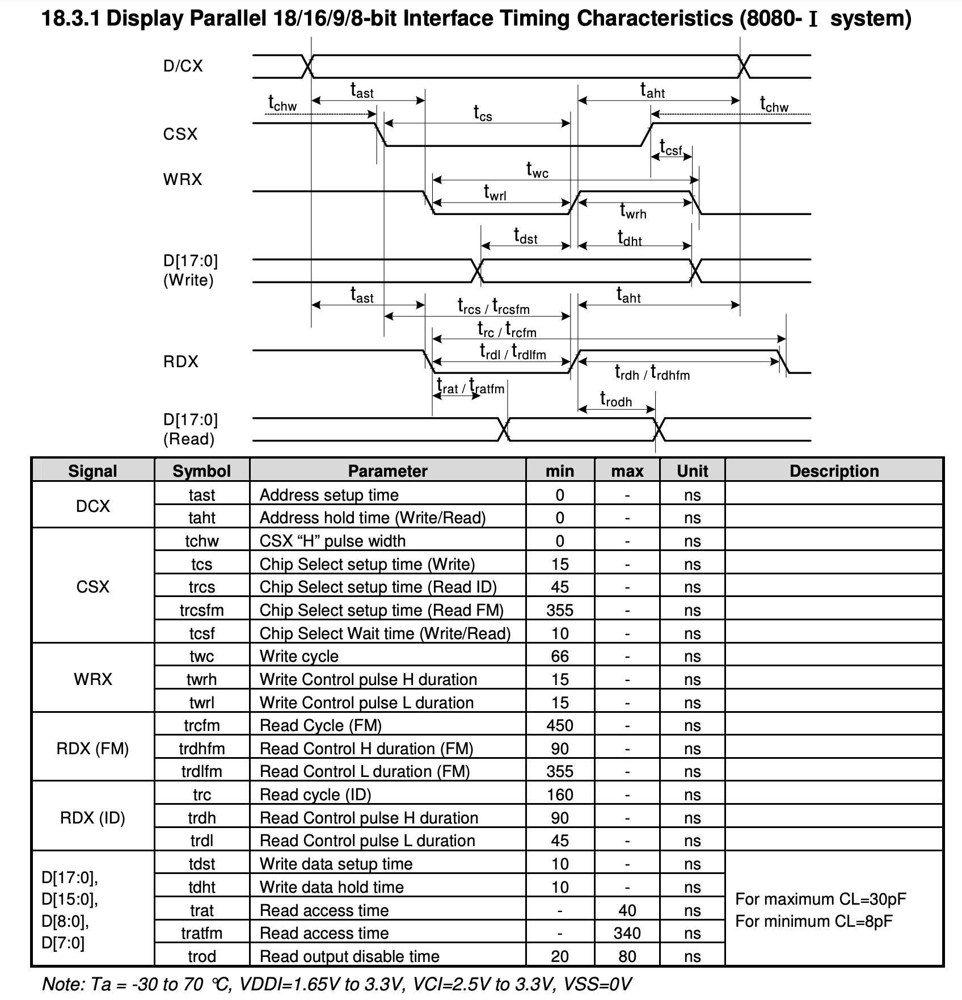
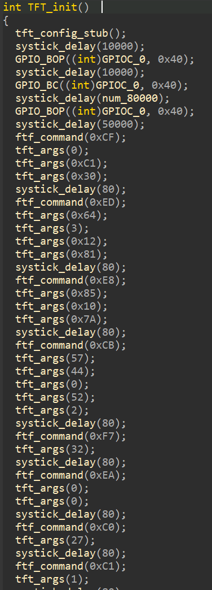
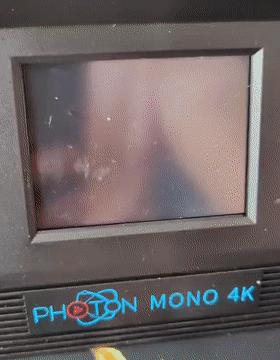

Part 6: Taking control of the user-facing LCD display
=====================================================

In the [previous part](../part5/README.md), we extracted the UI backgrounds and
other various fonts. Let's try to draw them on the printer's display.

Because there are two LCD screens, the user-facing LCD display, and the resin
masking LCD, we'll call the user-facing one the _display_, and the masking one
the LCD _panel_.



There are 27 signal wires connecting the MCU to the display. With this
number of wires, we are not going to try to guess how to interface with it. We
are going to disassemble the MCU firmware downloaded in [Part
1](../part1/README.df) and try to see how the code uses the display.

A visual inspection of the firmware:

```
convert -size 1024x1745 -depth 1 GRAY:mcu.bin'[0]' mcu.png
```







There's two programs in the MCU:
* **The bootloader**: This is the program that runs immediately on power-on. Its
  role is to flash the MCU during a firmware from the external flash chip.
  The way the firmware gets updated is that it gets copied from a USB dongle to
  the external flash, and then the machine restarts. The bootloader flashes the
  firmware from the external flash, and on success, clears the external flash
  from the firmware. This is so that if there's  a loss of power during a
  firmware update, the machine won't be bricked. We'll expand on into this later,
  it will be important for users flashing our firmware into their machines via
  a USB dongle.
* **The main program**: This contains all the logic to run the 3D printer. The
    bootloader transfers execution once done with flashing the firmware.

## Disassembling the bootloader

Luckily for us, the bootloader shows an update message while it's flashing the
MCU with a new firmware. That means that its initializes the display. We are
going to look at what it's doing.

Some research gives us pointers on how to decompile instructions for an STM32
like microcontroller. See [Reverse engineering of ARM
microcontrollers](https://rdomanski.github.io/Reverse-engineering-of-ARM-Microcontrollers/)
and [Reverse Engineering
Radios](https://do1alx.de/2022/reverse-engineering-radios-arm-binary-images-in-ida-pro/)

Note that I use IDA Pro, but I don't necessarily recommend it due to its price
and licensing structure. I use because I'm used to it.
I would recommend [Ghidra](https://ghidra-sre.org), a very capable
disassembler/decompiler and it's free.

After a bit of work, here's the `main` function of the bootloader:



I've annotated the code to see things a little clearer. We can see:
* Initialization of various peripherals: the system clock, the external flash,
  and the display.
* The flashing procedure, executed when the string `"FIRE"` is present the
  external flash at address `0xEF0000`.
* And an execution transfer control to the `MAIN_PROG`

## Initializing the system clock

The clock of the `GD32F30x` family is different form the `STM32f10x` one.
It can go faster. We want to run at the highest possible speed, like the
original firmware.

Max clock speed  | `STM32f10x` | `GD32F30x` 
-----------------|-------------|-----------
System clock     | 72 MHz      | 120 MHz
Peripheral Bus 1 | 36 MHz      | 60 MHz
Peripheral Bus 2 | 72 MHz      | 120 MHz
ADC bus          | 40 Mhz      | 14 MHz

The `GD32` has naturally more register configuration settings than the `stm32`
to set the clock speed. For example, you can set the PLL multipler up to x63,
used to scale the 8 MHz external oscillator to the 120 MHz internal clock.

There are additional power settings: the 1.2V power domain can be set to enter
a high-driver mode, recommended when running at high frequency. I'm not sure
what that means, but it sure doesn't sound friendly to the battery life if one
were to use this in a wireless device.

This was a frustrating one. Here's what I tried:
* Modify the `stm32f1xx-hal` crate to support the higher frequencies. This
  didn't work. I wasn't getting the 120 MHz clock speed, which I can measure
  with two debug statements separatated by a programmed delay of precisely 10
  seconds. If the measured delay is not 10 seconds, that means that the clock
  is incorrectly setup.
* Try using code from a different `stm32` family. Not useful.
* Use the `GD32F30x` official SDK. They provide a `setup_clock_120m_hxtal`
  function that is specifically based on using a 8 MHz external oscillator.
  Re-implement it in Rust. The register names are different from the `stm32`
  device definition crate I'm using. So I'm using the device definition
  generated from the official SVD file with `svd2rust`. Interestingly, the
  code initializes two different PLLs. Also, some of the configuration bits
  (like the higher bits of the PLL multiplier) described in the datasheet are
  not at the same location as described in the datasheet. But the clock
  configuration is still not running at 120 MHz.
* I flashed the orignal firmware and read the values of the clock
  configuration registers. To see the registers in a readable format, there's
  a GDB plugin [`PyCortexMDebug`](https://github.com/bnahill/PyCortexMDebug)
  that given a SVD file, prints the registers and bits with their
  interpretations so I could spot the differences. I figured this would be
  useful for other things. Sadly, the provided GDB from `brew install
  armmbed/formulae/arm-none-eabi-gcc` isn't compiled with Python integration.
  So I'm going down the rabbit hole of compiling my own GDB with Python
  support. Sadly, there are some compilation errors on my system. Okay.
  I modified the source of GDB to get it to compile. Also providing which
  python library to link from is not documented, but after going through their
  build script, I manage the find the right configuration. It's `./configure
  --prefix=$(pwd)/build --with-python=$(which python3) --target=arm-none-eabi
  --with-expat -with-mpfd`.

We finally can read nicely the original firmware register values:

```
Loading SVD file ../repos/gd32-rs/svd/gd32f307.svd...
(gdb) svd/a RCU
Registers in RCU:
        CTL:         0x0F037E83 <No symbol matches 0x0F037E83.>  Control register
        CFG0:        0x20B7440A <No symbol matches 0x20B7440A.>  Clock configuration register 0 (RCU_CFG0)
        INT:         0x00000000 <No symbol matches 0x00000000.>  Clock interrupt register (RCU_INT)
        APB2RST:     0x00000000 <No symbol matches 0x00000000.>  APB2 reset register (RCU_APB2RST)
        APB1RST:     0x00000000 <No symbol matches 0x00000000.>  APB1 reset register (RCU_APB1RST)
        AHBEN:       0x00000100 <No symbol matches 0x00000100.>  AHB enable register
        APB2EN:      0x0000007C <No symbol matches 0x0000007C.>  APB2 clock enable register (RCU_APB2EN)
        APB1EN:      0x10004000 <No symbol matches 0x10004000.>  APB1 clock enable register (RCU_APB1EN)
        BDCTL:       0x00000018 <No symbol matches 0x00000018.>  Backup domain control register (RCU_BDCTL)
        RSTSCK:      0x0C000000 <No symbol matches 0x0C000000.>  Reset source /clock register (RCU_RSTSCK)
        AHBRST:      0x00000000 <No symbol matches 0x00000000.>  AHB reset register
        CFG1:        0x00010617 <No symbol matches 0x00010617.>  Clock Configuration register 1
        DSV:         0x00000000 <No symbol matches 0x00000000.>  Deep sleep mode Voltage register
        ADDCTL:      0x7C000000 <No symbol matches 0x7C000000.>  Additional clock control register
        ADDINT:      0x00000000 <No symbol matches 0x00000000.>  Additional clock interrupt register
        ADDAPB1RST:  0x00000000 <No symbol matches 0x00000000.>  APB1 additional reset register
        ADDAPB1EN:   0x00000000 <No symbol matches 0x00000000.>  APB1 additional enable register
(gdb) svd/d RCU CFG0
Fields in RCU > CFG0:
        SCS:            2  System clock switch
        SCSS:           2  System clock switch status
        AHBPSC:         0  AHB prescaler selection
        APB1PSC:        4  APB1 prescaler selection
        APB2PSC:        0  APB2 prescaler selection
        ADCPSC_1_0:     1  ADC clock prescaler selection
        PLLSEL:         1  PLL Clock Source Selection
        PREDV0_LSB:     1  The LSB of PREDV0 division factor
        PLLMF_3_0:     13  The PLL clock multiplication factor
        USBFSPSC_1_0:   2  USBFS clock prescaler selection
        CKOUT0SEL:      0  CKOUT0 Clock Source Selection
        ADCPSC_2:       0  Bit 2 of ADCPSC
        PLLMF_5_4:      1  Bit 5 and Bit 4 of PLLMF
        USBFSPSC:       0  Bit 2 of USBFSPSC
(gdb) svd/d RCU CFG1
Fields in RCU > CFG1:
        PREDV0:     7  PREDV0 division factor
        PREDV1:     1  PREDV1 division factor
        PLL1MF:     6  The PLL1 clock multiplication factor
        PLL2MF:     0  The PLL2 clock multiplication factor
        PREDV0SEL:  1  PREDV0 input Clock Source Selection
        I2S1SEL:    0  I2S1 Clock Source Selection
        I2S2SEL:    0  I2S2 Clock Source Selection
        ADCPSC_3:   0  Bit 4 of ADCPSC
        PLLPRESEL:  0  PLL Clock Source Selection
        PLL2MF_4:   0  Bit 5 of PLL2MF
```

There we go. The official SDK uses a `PREDV0` and `PREDV1` of 5 and 10
incorrectly. It should be 7 and 1, as configured by the original firmware.

It finally works. The configuration seems a bit convoluted but that will do
for now. The implementation is in
[/src/src/drivers/clock.rs](/src/src/drivers/clock.rs).

## Intializing the I/O pins to the display, and the external memory controller

We are going to study the display initialization procedure as we are going
to replicate it.

First, the I/O pin to interact with the display are initialized. Then, the
EXMC controller. The display exposes a 17-bit parallel data bus.
Our microcontroller has a peripheral that can interface with such parallel bus
in an efficient way, the External Memory Controller  `EXMC` (on GD32s) a.k.a
the Flexible Static Memory Controller `FSMC` (on STM32s). It's used to
interface with various devices such as SRAMs, NOR Flashes, etc.

I'm grepping through the `GD32F30x` SDK (provided by the manufacturer)
to find examples of code using the `EXMC` as it can be pretty hairy to
initialize.  I land on an LCD display initialization example. The developers
of the Mono 4K used the code example from the SDK.



Neat, we understands the semantics of of the values they are using:

```c
bus_latency = 10;
data_setuptime = 15;
address_holdtime = 8;
address_setuptime = 8;
```

In the main program, this is what is being used:

```c
bus_latency = 20;
data_setuptime = 30;
address_holdtime = 16;
address_setuptime = 16;
```

Turns out, these latency values are way higher than they need to be.
Additionally, when writing data to the dislpay, the
`address_holdtime/setuptime` can be `0`. I later on see that the display
samples the data wires and address (one wire) at the same time. Also
`bus_latency` is not used.



Above is the timing diagram of writing commands to the device from the MCU
perspective.



Above is the timing requirements of an
[`ILI9341`](https://cdn-shop.adafruit.com/datasheets/ILI9341.pdf) based
display. It looks complicated, but it's not that bad. All that matters are the
"Write" parameters. We can pretty much push the signal to a time period of 10ns.
The developers are using 30+16 clock cycles which is 380ns at 120MHz. We can
address the display 30x faster.

We can start implementing our code. I found the
[`stm32-fmc`](https://github.com/stm32-rs/stm32-fmc) crate that does a good
job at abstracting away the details of `EXMC` register configuration.
It's used by the [`stm32h7xx-hal`](https://github.com/stm32-rs/stm32h7xx-hal)
crate. And it has a [driver for an LCD
display](https://github.com/stm32-rs/stm32f7xx-hal/blob/master/src/fmc_lcd/mod.rs)
as well. Fabulous!

[...few hours later...] Or so I thought. These HALs and drivers are
convoluted, difficult to use, try to provide too much typing semantics for
users, turning into an unusable mess.

Here's the full configuration of the `EXMC`. Turns out, no need for
complicated HALs for this one:

```rust
let reset = gpioc.pc6.into_push_pull_output(&mut gpioc.crl);
let _notsure = gpioa.pa6.into_push_pull_output(&mut gpioa.crl);
let backlight = gpioa.pa10.into_push_pull_output(&mut gpioa.crh);

// This initializes the EXMC module for the TFT display
unsafe {
    // Enables the EXMC module
    (*pac::RCC::ptr()).ahbenr.modify(|_,w| w.bits(1 << 8));
}
// PD4: EXMC_NOE: Output Enable
gpiod.pd4.into_alternate_push_pull(&mut gpiod.crl);

// PD5: EXMC_NWE: Write enable
gpiod.pd5.into_alternate_push_pull(&mut gpiod.crl);

// PD7: EXMC_NE0: Chip select
gpiod.pd7.into_alternate_push_pull(&mut gpiod.crl);

// A16: Selects the Command or Data register
gpiod.pd11.into_alternate_push_pull(&mut gpiod.crh);

// PD14..15: EXMC_D0..1
// PD0..1:   EXMC_D2..3
// PE7..15:  EXMC_D4..12
// PD8..10:  EXMC_D13..15
gpiod.pd14.into_alternate_push_pull(&mut gpiod.crh);
gpiod.pd15.into_alternate_push_pull(&mut gpiod.crh);
gpiod.pd0.into_alternate_push_pull(&mut gpiod.crl);
gpiod.pd1.into_alternate_push_pull(&mut gpiod.crl);
gpioe.pe7.into_alternate_push_pull(&mut gpioe.crl);
gpioe.pe8.into_alternate_push_pull(&mut gpioe.crh);
gpioe.pe9.into_alternate_push_pull(&mut gpioe.crh);
gpioe.pe10.into_alternate_push_pull(&mut gpioe.crh);
gpioe.pe11.into_alternate_push_pull(&mut gpioe.crh);
gpioe.pe12.into_alternate_push_pull(&mut gpioe.crh);
gpioe.pe13.into_alternate_push_pull(&mut gpioe.crh);
gpioe.pe14.into_alternate_push_pull(&mut gpioe.crh);
gpioe.pe15.into_alternate_push_pull(&mut gpioe.crh);
gpiod.pd8.into_alternate_push_pull(&mut gpiod.crh);
gpiod.pd9.into_alternate_push_pull(&mut gpiod.crh);
gpiod.pd10.into_alternate_push_pull(&mut gpiod.crh);

unsafe {
    dp.FSMC.bcr1.write(|w| w
        // Enable NOR Bank 0
        .mbken().set_bit()
        // data width: 16 bits
        .mwid().bits(1)
        // write: enable
        .wren().set_bit()
    );
    dp.FSMC.btr1.write(|w| w
        // Access Mode A
        .accmod().bits(0)
        // Address setup time: not needed.
        .addset().bits(0)
        // Data setup time and hold time.
        // (2+1)/120MHz = 25ns. Should be plenty enough.
        // Typically, 10ns is the minimum.
        .datast().bits(2)
        .datlat().bits(2)
    );
}
```

We need to understand what kind of display we are interfacing with.
The decompiled initialization procedure gives us a hint:



After some research, we find that the display is one similar to a
[`ILI9341`](https://cdn-shop.adafruit.com/datasheets/ILI9341.pdf). There's
plenty of code that shows different initialization procedures, but we'll stick
to the one that this particular display vendor accepts.

Addressing the display is a fairly simple endavor.

## Displaying something

The MCU we are using has only 96KB of RAM, and the image to be displayed is
`320*240*2=150KB`. We can't hold the displayed image in memory. This means
that we have to continuously draw the background images from the external flash.

The way we draw to the LCD display is simple. We send the `0x2A` and `0x2B`
commands to define the region on the display that we want to draw on, and use
the `0x2C` command to send the pixel values one by one. That's about it.

```rust
pub fn start_drawing(&mut self, top_left: (u16, u16), bottom_right: (u16, u16)) {
    let (left, top) = top_left;
    let (right, bottom) =  bottom_right;

    self.write_cmd(0x2A);
    self.write_data_as_two_u8(left);
    self.write_data_as_two_u8(right - 1);
    self.write_cmd(0x2B);
    self.write_data_as_two_u8(top);
    self.write_data_as_two_u8(bottom - 1);
    self.write_cmd(0x2C);
    // Then use `self.write_data(value: u16)` to send pixel values
}
```

With this, we can start building abstractions to draw things. We can also
integrate with [`embedded-graphics`](https://github.com/embedded-graphics/embedded-graphics)
to draw 2D graphics primitives, including text.

After some fiddling, we can take over the display:



This demo is actually a bit complicated to implement, because as the text
moves, we need to redraw the background where it needs to be invalidated.
We might want to create abstractions to support some kinds of layer system as
we have a background, UI elements (buttons, text), and on top we can have a
modal box.

The source code driving the display can be found in
[/src/src/drivers/display.rs](/src/src/drivers/display.rs).
