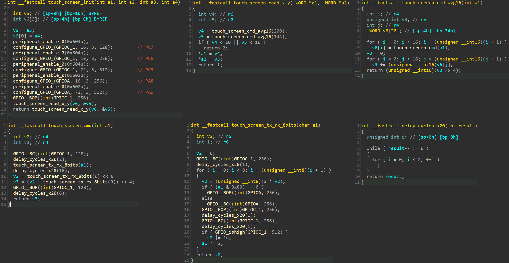

Part 7: Detecting touches on the display
========================================

In the [previous part](../part6/README.md), we were able to display images on
the touch-screen. It's a natural next step to detect touches on the display.

To locate the code in the firmware disassembly that interface with the
touch detection device, the easiest is to identify the pins connected with it.
I've identified two pins connected to the display connector that are not used
for driving the LCD display: `PC7` and `PC8`. Therefore, they must be used for
the sensing touches. Going through the various initialization routines, I
found the touch detection initialization routines in the IDA Pro disassembly:

The touch detection device seems vaguely similar to a
[`FT5x16`](https://www.newhavendisplay.com/app_notes/FT5x16.pdf).

Essentially, there are 5 wires to interface it:

 MCU Pin | Name    | Description
---------|---------|-------------
`PC7`    | `CS`    | Chip select wire. Must be driven low when communicating.
`PC8`    | `SCK`   | SPI clock wire
`PC9`    | `MISO`  | SPI master input / slave output
`PA8`    | `MOSI`  | SPI master output / slave intput
`PA9`    | `TOUCH` | Driven high when there's a touch detected. Good to plug in on an interrupt line.

We can replicate the code to interface with the device, and detect touches. Note
that we have to do the SPI interface in software as these pins are not connected
to any hardware SPI peripherals.

Here's a demo of the touch screen integrated with the display:

Pretty cool!

The source code detecting touches can be found in
[/src/src/drivers/touch_screen.rs](/src/src/drivers/touch_screen.rs).
