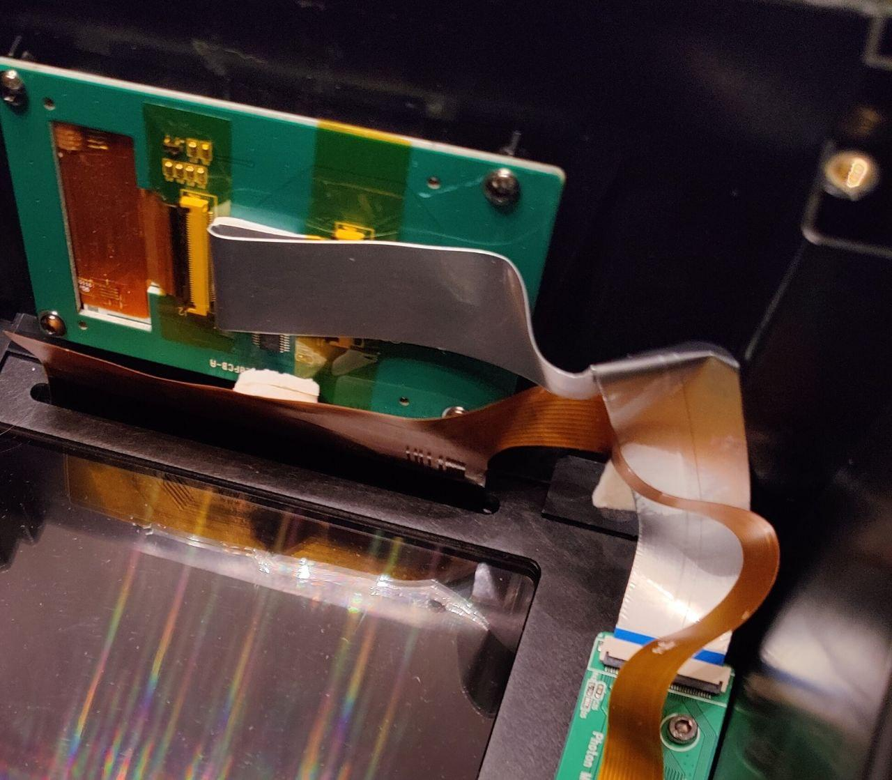
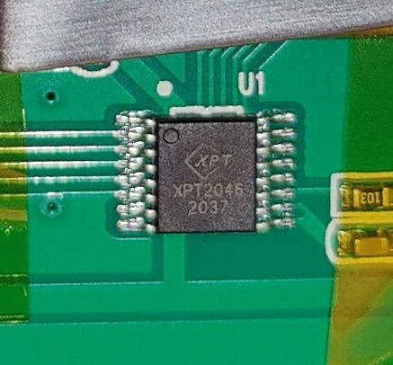
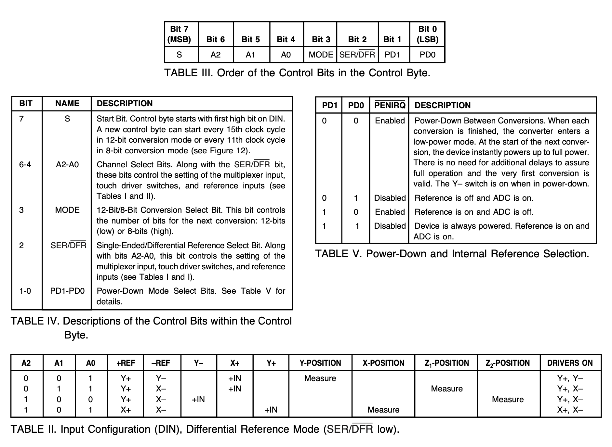
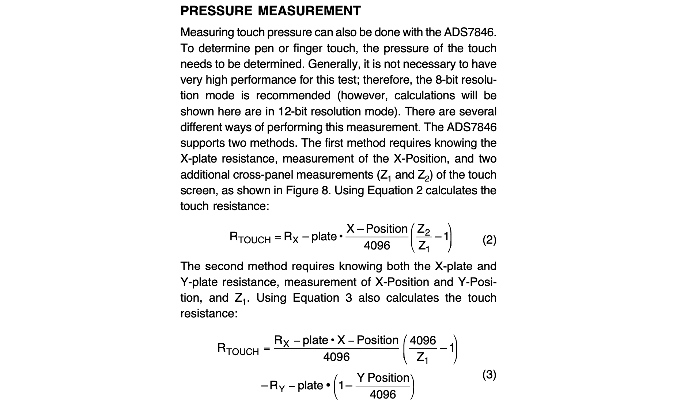

Part 7: Detecting touches on the display, and improving on the original firmware
=================================================================================

In the [previous part](../part6/README.md), we were able to display images on
the touch-screen. It's a natural next step to detect touches on the display.

To locate the code in the firmware disassembly that interface with the
touch detection device, the easiest is to identify the pins connected with it.
I've identified two pins connected to the display connector that are not used
for driving the LCD display: `PC7` and `PC8`. Therefore, they must be used for
the sensing touches. Going through the various initialization routines, I
found the touch detection initialization routines in the IDA Pro disassembly:

The touch detection device seems vaguely similar to a
[`FT5x16`](https://www.displayfuture.com/Display/datasheet/controller/FT5x06.pdf).

Essentially, there are 5 wires to interface it:

 MCU Pin | Name    | Description
---------|---------|-------------
`PC7`    | `CS`    | Chip select wire. Must be driven low when communicating.
`PC8`    | `SCK`   | SPI clock wire
`PC9`    | `MISO`  | SPI master input / slave output
`PA8`    | `MOSI`  | SPI master output / slave intput
`PA9`    | `TOUCH` | Driven high when there's a touch detected. Good to plug in on an interrupt line.

We can replicate the code to interface with the device, and detect touches. Note
that we have to do the SPI interface in software as these pins are not connected
to any hardware SPI peripherals.

The way the protocol goes is the following:

* Send `0x90`
* Receive high 8 bit of the 16 bits value of x
* Receive low 8 bit of the 16 bits value of x
* Send `0xD0`
* Receive high 8 bit of the 16 bits value of y
* Receive low 8 bit of the 16 bits value of y

Values needs to be scaled, debounced, but that's about it.

Here's a demo of the touch screen integrated with the display:

Pretty cool!

## Fixing the touch screen accuracy

The original firmware didn't handle finger touches so well, which is the
reason why I always needed to use a stick on the touch screen.

See the problem:

At first, I'm pressing with my nail and the touch points are well detected.  But
then I use less pressing force and press with my finger pillow side. You can see
the points are all over the place. This has bad consequences with the original
firmware:

It doesn't detect the position of my finger correctly, and it goes all over the place.
THe UI buttons are incorrectly pressed.

We can try probing for some pressure value. We know that `0x90` and `0xD0` are
used to read `x` and `y` values, so perhaps the pressure value `z` isn't too far.

I tried reading values from commands `0x00` to `0xFF`, and `0x16` seemed to be
the only one related to the touch pressure. I found the touch pressure to be `z
= cmd(0x16)/y`. It's a bit odd, but it works out. When `z > 0.35`, the touch
points are reliable.

Here's how it looks when rejecting points with little pressure:

Much better! It's not the greatest touch screen in the world, but at least it's
accurate.

## Identifying the touch screen controller and improvements

Based on the protocol, [Marijn correctly
identified the touch screen controller](https://github.com/nviennot/reversing-mono4k/issues/3) as an `XPT2046`.

Few days later, I took a photo of the controller seen under the ribbon cable:

He got it right! Impressive!

Here's the datasheet of the [`XPT2046`](/datasheet/XPT2046.pdf), which is
essentially a clone of the [`ADS7846`](/datasheet/ads7846.pdf), originally made
by the [Burr-Brown](https://en.wikipedia.org/wiki/Burr-Brown_Corporation)
corporation, acquired by Texas Instruments in 2000.

This provides visibility in what we were doing. The control bits are described:

The command begins with a start bit `S = 1`, then three bits that constitute the
actual command, then one bit to select 12 or 8-bit sampling, one bit to
configure how the ADC is configured (0 is always good for us), and lastly two
bits to configure power.

Regarding the `0x90 = 0b10010000` and `0xD0 = 0b11010000`, clearly we see that
it corresponds to the `001` and `101` commands from table II, measuring X and Y
positions with 12-bit precision (mode = 0). (X and Y are swapped in our
situation).

The command I used to detect pressure `0x16 = 0b00010110` doesn't exist, as it
doesn't have a start bit. It worked because the first high bit signals the
start of the command (unlike the SPI protocol, for which the chip select pin
going down is the indication), and so the effective command I sent was
`10110000`. This measures the Z1 position in 12 bits precision.

Okay, so we were vaguely doing the (3) equation, but we missed the offset
incurred by the X position (X and Y are swapped in our application).

We can improve the touchscreen accuracy with the following:
* Leave the device powered on while sampling touch values, apparently that makes
  the VREF internal generator more stable, giving us better accuracy (which is
  what the differential reference mode uses)
* Leave the CS pin down during the entire sampling of data
* Do robust pressure measurements

The source code detecting touches can be found in
[/src/src/drivers/touch_screen.rs](/src/src/drivers/touch_screen.rs).

Next, we are going to move the build plate.

[Go to Part 8](../part8/README.md)
