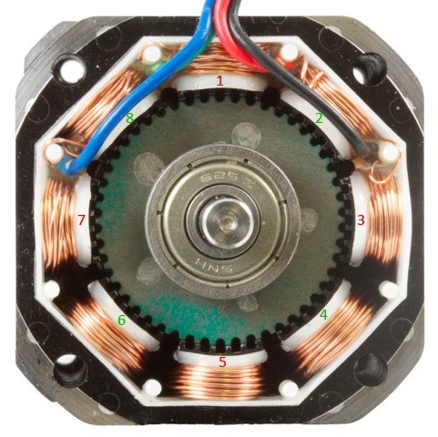
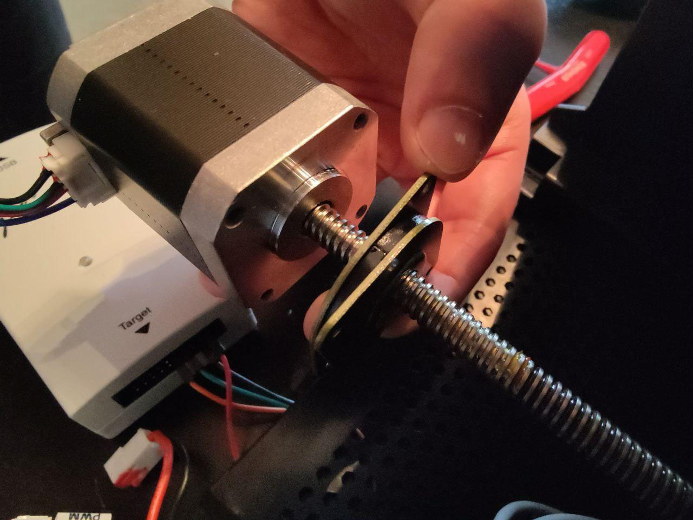
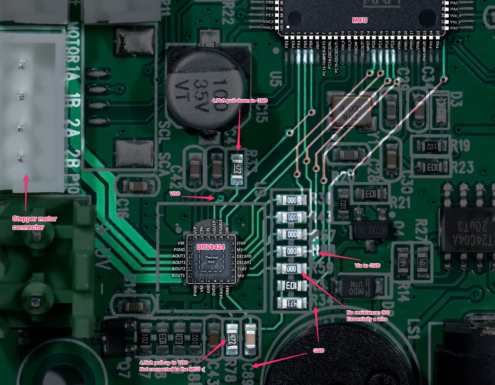
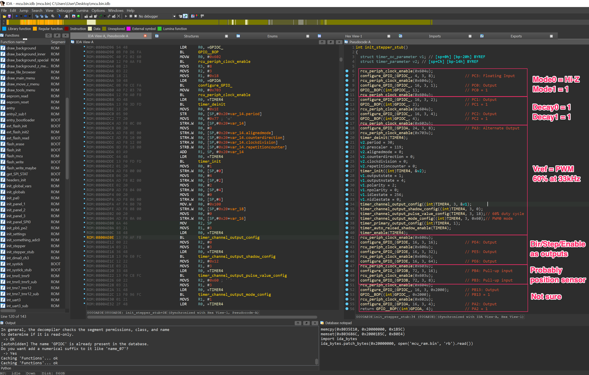
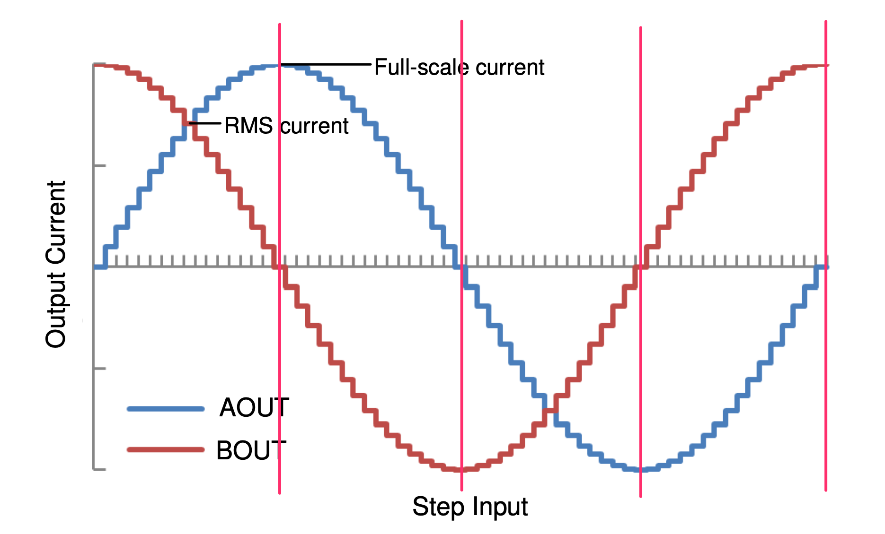
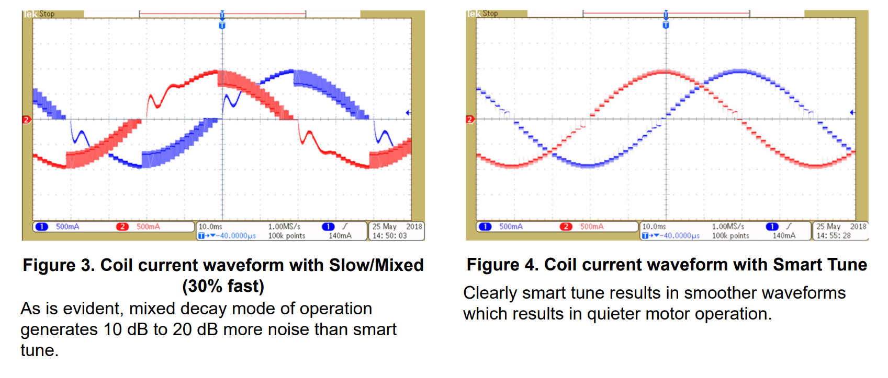
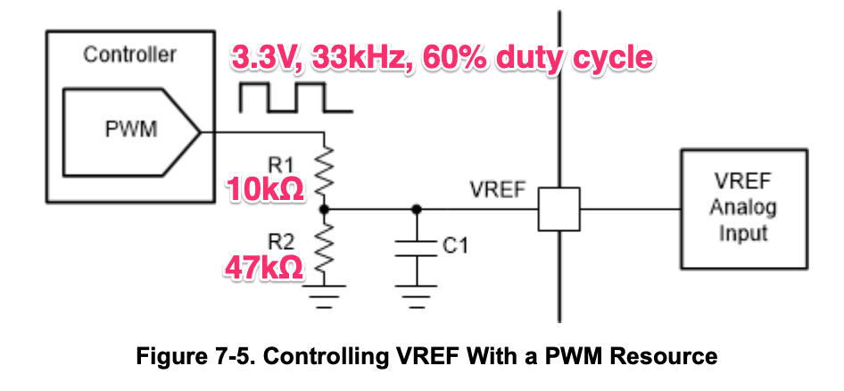
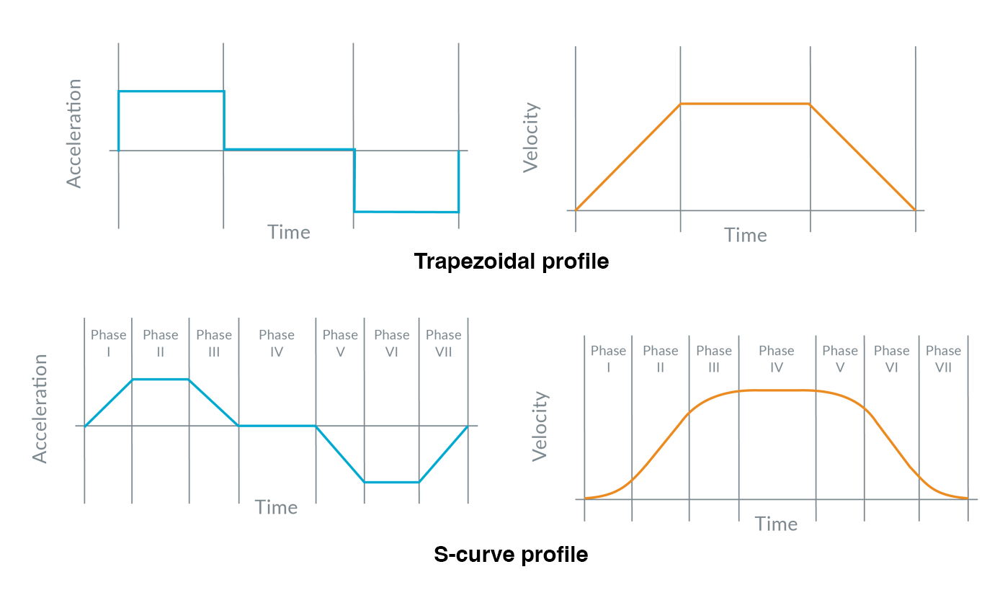
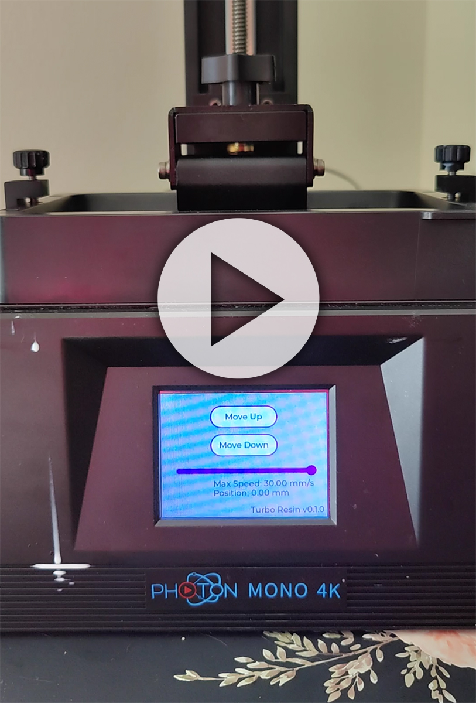

Part 8: Driving the Z-axis stepper motor
========================================

In the [previous part](../part7/README.md), we were able to sense touches on the
display. We can try to build a UI to actuate something, like moving the build
plate of the printer.

## How stepper motors work

Before we start, it's a good idea to understand how stepper motors work

_Photo from [phidgets.com](https://www.phidgets.com/docs21/Stepper_Motor_and_Controller_Primer)_

Our stepper motor has two independent set of 4 electromagnets that can be
energized independently. On the above photo, these two sets correspond to the
red and green numbers.

When the red coils are energized positively (current flowing in the coil in one
direction), the electromagnet _1_ and _5_ are attracting the rotor teeth, while
_3_ and _7_ are repulsing them. This is done by having the _1_ and _5_ coils
wired say, clockwise, and the _3_ and _7_ wired counter-clockwise.

As long as the coils are energized, the rotor is strongly held in place. This is
the configuration we are in on the photo.

To advance a step, we can stop energizing the red coils, and energize the green
coils. You see on the photo, the teeth of the rotor would snap in place to align
with _2_. That's what advancing by a full step represents. The rotor advances by
a tooth when we perform the following operations: red positively energized,
green positively energized, red negatively energized, green negatively
energized. So 4 full steps are needed to advance the rotor by one tooth.
Because rotors have typically 50 teeth, this is why we have to perform __200
full steps to do a full rotation__.

Our stepper motor is connected to a lead screw, with a pitch of 2.0 mm, carrying
the build plate. That means that a full step translates the build plate by 10
µm. Typically, the precision of a stepper motor is 5% of a full-step, so that's
a 0.5 µm accuracy. Nice.

The stepper motor in the printer has no part number, so it's a little tricky to
identify. It has a XY laser mark on the back. It measures 40x40x48mm. The lead
screw is part of the motor and measures 250 mm with a pitch of 2.0 mm. I
measured each phase resistance to 2.2 Ω.

Search for "linear stepper motor" shows various models. 48mm stepper motors with
this phase resistance are typically rated for a maximum phase current of 1.7 A.
This is useful information if we'd like to increase the current in the motor, if
we want to make it go fast.

## Analyzing the PCB

We can start with observing the PCB to see how it gets actuated:

I've highlighted the relevant traces using Photoshop. The traces on the back of
the PCB are shown in red. I've also overlayed the component pinouts so we can
give names to the traces.

We have the MCU on the top right. It interfaces to a stepper motor driver, the
[`DRV8424`](https://www.ti.com/product/DRV8424) from Texas Instruments in the
middle. The stepper motor connects to a header to the left. I was quite
surprised at how small the driver is: 4x4 mm. That's not much to dissipate the
power that it's driving. There's normally a heat sink glued to the driver that
has the size of the white outline, but I removed it for the photo.

Also note the 0 Ω resistors. They are normally used to get over a trace, but in
this case, there's nothing useful traces to cross. So that's a little strange.

The [datasheet of the `DRV8424`](/datasheet/drv8424.pdf) is helpful to
understand what is going on. In a nutshell, sending pules on the `STEP` pin
makes the stepper motor move by one step. The direction of the rotation is
selected by driving the `DIR` pin high or low.

It gets more complicated. Here's the pinout of the driver:

 DRV Pin | Connection | Description
---------|------------|-------------
`nSLEEP` | VDD        | Sleep. VDD=3.3V means never go to sleep
`ENABLE` | `PE6`      | Whether to energize the motor
`DIR`    | `PE4`      | The rotation direction of the stepper motor
`STEP`   | `PE5`      | Advance the motor by one step on a rising edge
`MODE0`  | `PC3`      | Micro-stepping configuration, see below
`MODE1`  | `PC0`      | Micro-stepping configuration, see below
`DECAY0` | `PC1`      | Current decay configuration, see below
`DECAY1` | `PC2`      | Current decay configuration, see below
`TOFF`   | GND        | Decay off time, GND corresponds to the minimum of 7µs
`VREF`   | See below  | Configures the amount of current the motor receives
`nFAULT` | N/C        | Indicates a fault

It's best to look at how the original configures the firmware so we have an idea
of how it configures the stepper motor driver.

## Analyzing the firmware

It didn't take long before I was able to locate the function that initializes
the stepper motor. Here's a screenshot of the fully annotated function:

The timer functions source code were discovered in the official firmware, and I
was able to match to the disassembled functions.

## Microstepping

The mode configuration table, from the DRV8424 datasheet:

 Mode0  | Mode1    | Step mode
--------| ---------|------------
 0      | 0        | Full step (100% current)
 0      | 330k GND | Full step (71% current)
 1      | 0        | Non-circular 1/2 step
 Hi-Z   | 0        | 1/2 step
 0      | 1        | 1/4 step
 1      | 1        | 1/8 step
 **Hi-Z** | **1**  | **1/16 step**
 0      | Hi-Z     | 1/32 step
 0      | 330k GND | 1/64 step
 Hi-Z   | Hi-Z     | 1/128 step
 1      | Hi-Z     | 1/256 step

The firmware configures the mode as 1/16 step. This activates the microstepping
feature. So what is microstepping? Remember that a full-step is going from
energizing one phase to another? Well, we can transition the coil activation
from one to another gradually.

Here's a diagram from the datasheet. I've added some vertical lines to denote
full steps. By controlling the transition from a coil to another, we can
position the stepper motor in between steps. Here's an article from Hackaday
that explains this more in depth: [How accurate is microstepping
really](https://hackaday.com/2016/08/29/how-accurate-is-microstepping-really/).
The number of steps between full step can be picked arbitrarily. On the diagram,
we see 16 microsteps per full step. This greatly reduce the noise the motor
and improves accuracy compared to full step increments.

The firmware configures the driver to use 16 microsteps per full step. In our
firmware, we'll be using 256 microsteps at slow speed to make the stepper motor
butter smooth and quiet. Note that accuracy won't improve. Using 16 microsteps
is pretty much the best you can do in terms of accuracy (1/16 = 6.25%, roughly
the accuracy tolerance of a stepper motor).

Note that the driver does not forget the step at which is it operating at, even
when the ENABLE pin is toggled.

## Motor current decay configuration

And the decay configuration:

Decay0 | Decay1 | Increasing Steps          | Decreasing Steps
-------|--------|---------------------------|----------------------------
 0     |   0    | Smart tune Dynamic Decay  | Smart tune Dynamic Decay
 0     |   1    | Smart tune Ripple Control | Smart tune Ripple Control
 1     |   0    | Mixed decay: 30% fast     | Mixed decay: 30% fast
**1**  | **1**  | **Slow decay**            | **Mixed decay: 30% fast**
 Hi-Z  |   0    | Mixed decay: 60% fast     | Mixed decay: 60% fast
 Hi-Z  |   1    | Slow decay                | Slow decay

The driver tries its best to regular the current flowing in the motor's coils,
and it's not easy because the desired current must changes at every step, and
the coil induction resists the change in current.

From [Smart tune for quiet and smooth stepper motor
operation](https://www.ti.com/lit/an/slvae80a/slvae80a.pdf):

Clearly, their Smart tune algorithm is good to have nice sine waves for current
regulation.

Also from [Getting smart about tuning your stepper
motor](https://e2e.ti.com/blogs_/b/analogwire/posts/getting-smart-about-stepper-tuning),
They have compelling examples of why Slow decay and Mixed decay is not so good,
and in fact, using Smart tune can reduce the temperature of the motor by at
least 5°C in their experiment.

In the [datasheet](/datasheet/drv8424.pdf), page 28, we are sold that the Smart
tune is better than the traditional methods of current decay.

> Smart tune Dynamic Decay greatly simplifies the decay mode selection by
> automatically configuring the decay mode between slow, mixed, and fast decay. In
> mixed decay, smart tune dynamically adjusts the fast decay percentage of the
> total mixed decay time. This feature eliminates motor tuning by automatically
> determining the best decay setting that results in the lowest ripple for the
> motor.

> The decay mode setting is optimized iteratively each PWM cycle. If the motor
> current overshoots the target trip level, then the decay mode becomes more
> aggressive (add fast decay percentage) on the next cycle to prevent regulation
> loss. If a long drive time must occur to reach the target trip level, the decay
> mode becomes less aggressive (remove fast decay percentage) on the next cycle to
> operate with less ripple and more efficiently. On falling steps, smart tune
> Dynamic Decay automatically switches to fast decay to reach the next step
> quickly.

So I don't understand why the original firmware doesn't use Smart tune. We'll
definitely use it in our firmware!

## Maximum current regulation

The stepper driver can be configured to deliver a specific amount of current to
the motor. Instead of being set statically, it can be changed by the MCU. By
varying the voltage on the VREF pin, we can proportionally change the current
delivered to the motor.

From the datasheet on page 21, we can find an application example when the VREF
pin is driven by a [Pulse Width Modulation
(PWM)](https://en.wikipedia.org/wiki/Pulse-width_modulation) signal:

This is the circuitry used in the printer. The resistors in question can be seen
on the PCB, and the PWM configuration in the firmware  I've annotated the
application example with the values that the Mono 4K designer used.

For those unfamiliar with PWM signals, it is generated using a pin that is
driven On and Off at a fast rate (here at 33kHz). The amount of time the pin
stays On compared to the (On+Off) time is called the duty cycle (here 60%).

The capacitor C1 paired with either resistors constitutes an RC circuit, making
a low-pass filter. That's going to smooth out the PWM signal, averaging it to a
constant voltage. The higher the frequency of the PWM, the less ripples the
signal has, and the more flat it appears.

The voltage on the VREF pin is `3.3V * PWM_duty_cycle * R2/(R1+R2)`. The last
term comes from the [voltage divisor with the resistors](https://en.wikipedia.org/wiki/Voltage_divider) R1 and R2.
This divisor reduces the voltage by `10/(47+10) = 0.825`.

In the datasheet of the driver, we are told:

> The full-scale regulation current (IFS) can be calculated as `IFS (A) = VREF
> (V) / KV (V/A) = VREF (V) / 1.32 (V/A)`.

So the current applied to the motor is `IFS = PWM_duty_cycle * 2.06 A`. In our
case we have a 60% duty cycle, so _the motor is energized with IFS = 1.24 A`_.

We could raise the current if we wanted to up to 2A, which is more than what
our stepper motor can handle. Typically 1.5-1.7A is the maximum so we have some
room for experimentation, especially if we only use a stronger current for a
short period of time. Perhaps it could increase accuracy.

## Motion profile

Stepper motors are driven with an open-loop feedback. That means that we have no
idea where the motor really is when driving it. We hope that it follows the
steps that we are instructing, but if it doesn't want to (stuck somewhere, or we
try to go too fast), we won't know. When driving a stepper motor, we have to be
gentle. We are injecting a certain amount of current in its windings, and that
means that we are subject to a maximum torque. We can't go from a standstill to
1500 RPM in one shot. The motor is just going to make some hissing sounds. That
means that we have to operate the motor with a maximum acceleration and speed
constraints.

_Figure from [S-curve and Trapezoidal Motion Control
Profiles](https://www.pmdcorp.com/resources/type/articles/get/mathematics-of-motion-control-profiles-article)_

The simple version of having a maximum acceleration and maximum speed gives a
trapezoidal speed profile. If we were driving something with a fair amount of
inertia, I would opt for an S-curve to reduce jerkiness and reduce mechanical
vibrations as acceleration is directly related to the applied force to an
object. But in our case, a simple trapezoidal curve is sufficient.

There's two Rust libraries we can use:
[ramp-maker](https://github.com/braun-embedded/ramp-maker) and
[stepgen](https://github.com/idubrov/stepgen). I only tried the former to get
things going.

The basic operations for driving a stepper motor on an MCU is the following:
1. Setup the desired direction (up or down in our case) by setting the `DIR`
   pin.
2. Pulse the `STEP` pin to make the stepper motor advance by one step
3. Query the motion profile for when to trigger the next step: `delay =
   motion_profile.next_step()`
4. Setup a timer to expire after the amount of time dictated by the motion profile `delay`
5. When the timer expires, go to step 2.

As you can see, the motion profile is computed on the fly. Pre-computing delay
values of the full motion is not possible with the amount of memory we have on
the chip. But it's fine. `stepgen` make use of this algorithm:
[Generate stepper motor speed profiles in real
time](https://www.embedded.com/generate-stepper-motor-speed-profiles-in-real-time/),
which use fixed-point arithmetic for low-end MCUs. On our MCU, we have a
floating point calculation unit, so it's even easier.

With 3D printing, the speeds involved are low and so the print time is mostly
due to moving the build plate around. We'll pull all the tricks we can use to
speed up the print time like using aggressive acceleration constraints,
or non-linear retract speed. I'm sure we can come up with something.

## Demo

We can put everything together, and make the stepper motor move with a nice
interface:

(clicking goes to Youtube).

I'm using [LVGL](https://lvgl.io/) for the UI which is much nicer than the
original interface. It brings a large footprint on the ROM, but I think it's
worth using.
