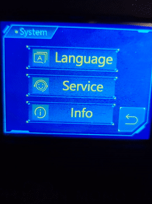
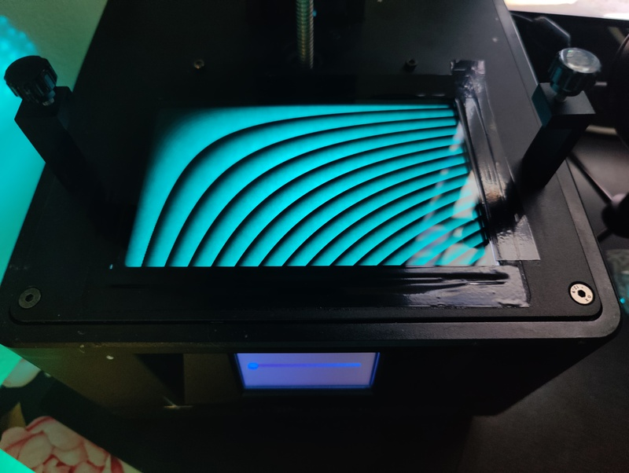
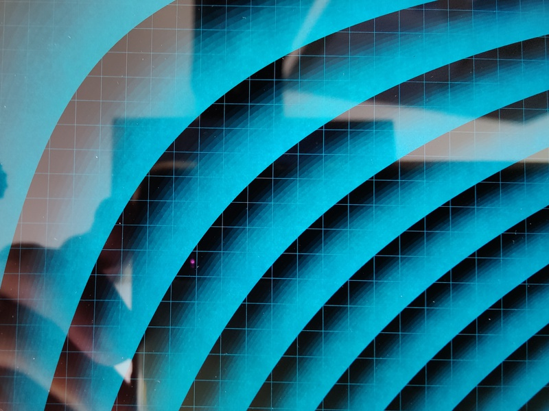
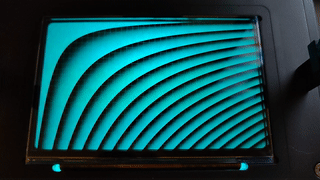
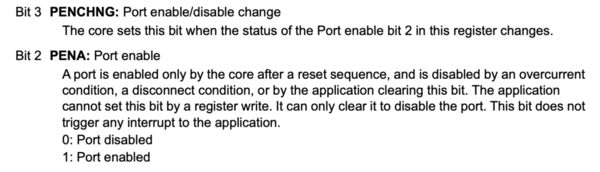
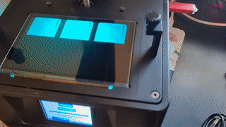
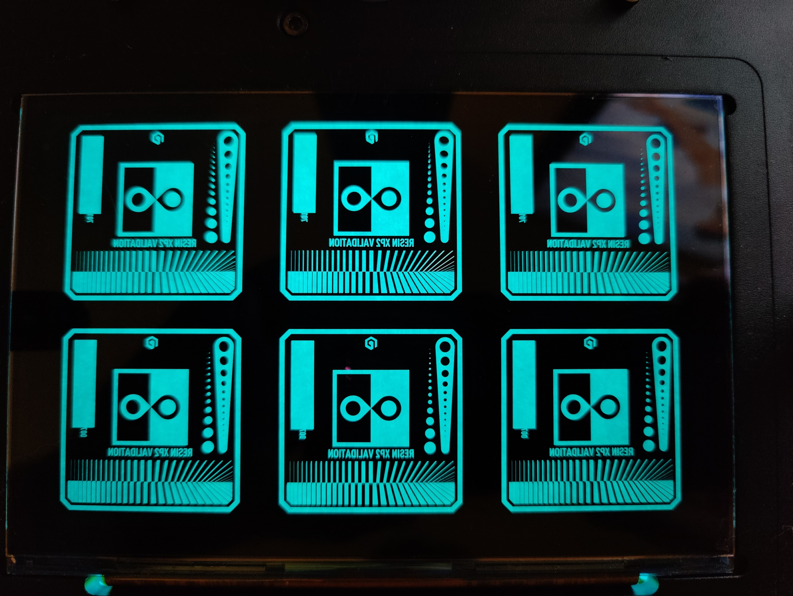
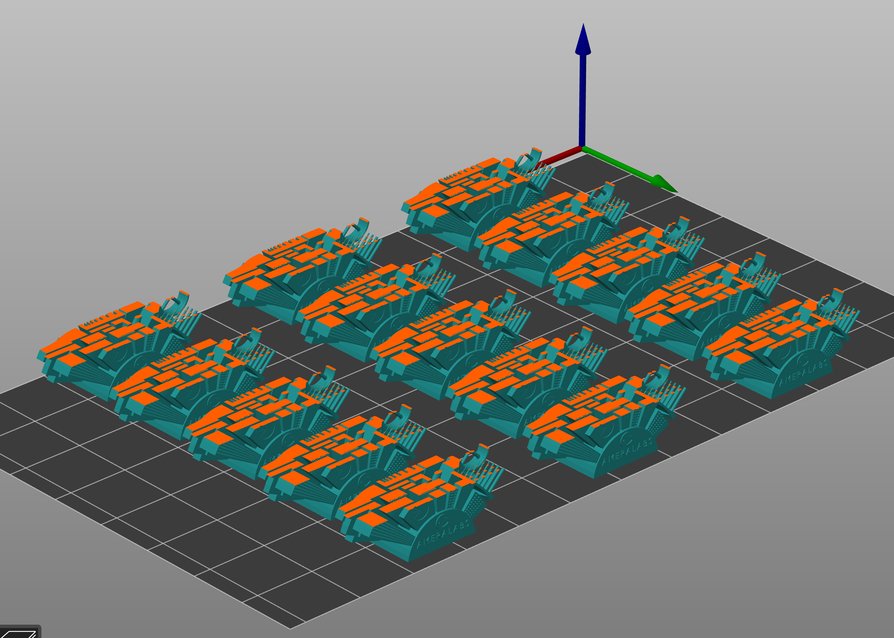
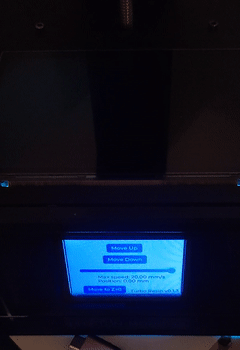
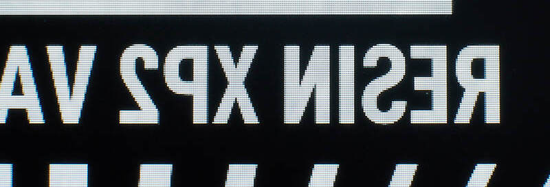

Part 9: Driving the LCD Panel, and displaying a print layer from the USB stick
==============================================================================

In the [previous part](../part8/README.md), we were able to drive the build
plate. It's time to display images on the LCD panel.

The hardware architecture is the following. The MCU sends pixel data via a
serial interface to the FPGA on board. This pixel data is saved in a SDRAM chip
connected to the FPGA. This memory chip contains the entire image that should be
displayed on the LCD panel. The LCD panel itself does not store the image. This
is what the Mobile Industry Processor Interface Display Serial Interface (MIPI
DSI) protocol dictates. It makes LCD panels cheaper to manufacture as they don't
need to carry additional memory to store the displayed image. Consequently, the
FPGA needs to refresh the displayed image many times a seconds, as the image
would fade away quickly.

```
┌────────────────┐               ┌────────────────┐             ┌────────────────┐
│                │               │                │  MIPI DSI   │                │
│                │  SPI 60Mb/s   │                │   1Gb/s     │                │
│      MCU       ├──────────────►│      FPGA      ├────────────►│   LCD Panel    │
│                │               │                │             │                │
│                │               │                │             │                │
└────────────────┘               └────────▲───────┘             └────────────────┘
                                          │
                                     ┌────▼────┐
                                     │         │
                                     │  SDRAM  │
                                     │         │
                                     └─────────┘
```

Interfacing with the FPGA
-------------------------

By disassembling the original firmware, with the help of
[Marijn](https://github.com/marijnvdwerf), we figured out how to talk to the
FPGA.

Here's a decompiled piece of code that makes the LCD panel all black:

```c
int LCD_panel_all_black()
{
  GPIO_BC((int)GPIOA, P4); // CS=0
  delay(10);
  LCD_panel_cmd(0xFB); // 0xFB command starts the drawing
  delay(60);
  GPIO_BOP((int)GPIOA, P4); // CS=1
  delay(6000);
  GPIO_BC((int)GPIOA, P4); // CS=0
  delay(10);
  LCD_panel_cmd(0xFB); // 0xFB command, again
  for (i = 0; i < 2400; ++i)
    for (j = 0; j < 960; ++j)
      SPI1_TX(0x0000); // Pixel data
  delay(60);
  GPIO_BOP(GPIOA, P4); // CS=1
}
```

Further disassembly shows various commands that the FPGA accepts:
* __GetVersion(opcode=`0xF0`) -> u32__. It returns a 32bit integer. On the
  mono 4k, it returns `0x100009`.
* __StartDrawing(opcode=`0xFB`)__. After this command, data received by the
  FPGA is interpreted as pixel data, 4 bits per pixel. This gives us 16
  different grayscale values.
* __SetPalette(opcode=`0xF1`, palette: [u8; 16])__. Each 4-bit pixel gets
  mapped to an 8-bit gray scale configurable through a palette. The
  default palette is set to `[0x00, 0x11, 0x22, ..., 0xEE, 0xFF]`.
  This command provides a way to set a custom the palette, and we'll later see
  how to use this feature to do multiple exposures.
* __GetPalette(opcode=`0xF2`) -> [u8; 16]__. This returns the current
  palette.
* __SetUnknown1(opcode=`0xF3`, [u16; 18])__. Don't know.
* __GetUnknown1(opcode=`0xF4`) -> [u16; 18]__. Don't know.
* __SetUnknown2(opcode=`0xFC`, [u16; 16])`__. Don't know.

Note that the disassembled code sends the StartDrawing command twice
because the FPGA implementation is buggy. Not doing so makes the second drawn
image have 1/3 of its pixels missing. We can see that the engineer where also
unsure what was going on judging by the unusual long delay they introduced
(`delay(6000)`).

Another amusing thing. Maybe we can consider this an easter egg. Tapping on
the upper right corner of the original firmware info panel reveals the FPGA
version:



Waves
-----

We can display pixels on the LCD panel. Here's a demonstration with different
curves with varying shades. I've also overlayed a grid with 100 pixel spacing.





Note: I've put a piece of paper under the LCD panel with a blue source light.

Animated waves
--------------



By rotating the palette values, we can animate our drawing. It wouldn't be
possible to do the animation fast as shown with just re-drawing the image
completely.  The time it takes to draw a full frame is `X_RES * Y_RES * bpp /
SPI_FREQ`, which is `3840*2400*4/60e6 = 614ms`. A little less than 2 fps.
Here we are drawing a new frame every `0.1s` by just changing the palette,
leaving the pixel data as is.

Printing from USB
------------------

This one was difficult because I needed to access the USB flash drive.  Sadly,
in the Rust ecosystem, there was no USB host drivers. So I wrote a USB stack
from scratch. You can find the source code in the [turbo-resin
repository](https://github.com/nviennot/turbo-resin/tree/main/src/drivers/usb).

The high level stack is the following:
* Interface with the Synopsys USB OTG IP core. There's 140 pages in the
  [datasheet](/datasheet/stm32f10x.pdf) explaining the interface. It's dense.
  This was the hardest part as there are some non-obvious behavior. I'll share
  one of the most painful bug I was debugging. When the USB port state
  changes (for example, when a USB device is ready), the bit `PENCHNG` is
  set to `1` triggering an interrupt. Writing `1` to this bit sets it to `0`.
  It's a little strange, but why not. This bit indicates that the bit `PENA`
  has changed. When `PENA` is set, it indicates that the port is active, which
  happens after a successful USB device reset. Turns out, it is very important
  to clear this bit, otherwise, the port becomes disabled for whatever reason.
  And this is what the datasheet says, "it can only clear it to disable the
  port", which is the opposite of what we are doing:

  

* So after being able to configure the USB core on board of the MCU, we must
  enumerate the USB device. This lets us know what kind of device it is, if
  it's a mouse or a disk for example.
* Once we detect a Mass Storage Device (MSC) connected, we open two data
  pipes, and activate the USB interface.
* All requests to the MSC operate over the Bulk Only Transfer protocol (BOT),
  wrapping the SCSI protocol.
* The SCSI protocol gives the ability to query the capacity of the drive, its
  block size, and issue read and write commands.
* At this point, we have a block device. I used the
  [embedded-sdmmc-rs](https://github.com/rust-embedded-community/embedded-sdmmc-rs)
  library for its implementation of the FAT file system. I changed it to
  support the Rust async API. One interesting implementation detail is that
  I've written the entire USB stack with Rust async. It wasn't easy as Rust
  async is not yet fully mature (async traits or async closures are not
  pleasant to use). However, it greatly simplified writing of the USB driver.
  Here's an example of the Rust code:

  ```rust
    debug!("USB waiting for device");
    self.wait_for_event(Event::PortConnectDetected).await?;

    debug!("USB device detected");

    // Let the device boot. USB Specs say 200ms is enough, but some devices
    // can take longer apparently, so we'll wait a little longer.
    Timer::after(Duration::from_millis(300)).await;

    self.reset_port();
    self.wait_for_event(Event::PortEnabled).await?;
    debug!("USB device enabled");
    Timer::after(Duration::from_millis(20)).await;

    // Starting enumeration
    const DEV_ADDR: u8 = 1;
    let mut ctrl = ControlPipe::new(0, 8);
    let dd = ctrl.get_descriptor::<DeviceDescriptorPartial>(0).await?;
    ctrl.set_address(DEV_ADDR).await?;
    let mut ctrl = ControlPipe::new(DEV_ADDR, dd.max_packet_size0 as u16);

    let device_descriptor = ctrl.get_descriptor::<DeviceDescriptor>(0).await?;
  ```

  All these `.await` keywords are allowing the function to return, and wait
  until a particular event triggered from within the USB interrupt
  routine. This means that the CPU can do something else while waiting for
  these events. Rust generates a state machine underlying so that when it's
  time to resume the work, it knows how to resume the execution of the
  function where it left off.
  All the USB Host C drivers have state machines implemented by hand. You can
  see these state machines on the `switch/case` statements in the
  [usbh_core.c](https://github.com/STMicroelectronics/STM32CubeF7/blob/master/Middlewares/ST/STM32_USB_Host_Library/Core/Src/usbh_core.c)
  file of the official STM32 driver.
* Once we can read files on the USB device, we can read regular Photon
  Workshop print files. To understand the format of such files, I used the
  work of Tiago Conceição, [UVtools](https://github.com/sn4k3/UVtools). It has
  support for a variety of print file formats, including the [Photon Workshop
  format](https://github.com/sn4k3/UVtools/blob/4f3dd8b3a7597ce5a9b7b45d2d825bd4ab03e07f/UVtools.Core/FileFormats/PhotonWorkshopFile.cs) that my Mono X 4k normally ingests. I made a Kaitai Struct ([photon.ksy](https://github.com/nviennot/turbo-resin/blob/main/src/file_formats/photon.ksy)), and a Rust parser ([photon.rs][https://github.com/nviennot/turbo-resin/blob/main/src/file_formats/photon.rs)).

We can finally display USB print file layers on the LCD panel. After a couple
of performance optimization, we get:



The image transfer from the USB stick to the LCD is roughly 2x faster than the
original firmware. My implementation is fast, but I think there's a way to
make it even faster, by pipelining the decoded data to the LCD using DMA, but
the performance were worst when I tried.

Multiple exposures
------------------

When trying to calibrate resin settings, we print little objects like the [XP2
resin
validation](https://github.com/Photonsters/Resin-exposure-finder-v2/releases)
, Dennys Wang's [Exposure tester
V2](https://cults3d.com/en/3d-model/various/exposure-tester-v2), or the
[Ameralabs town](https://ameralabs.com/blog/town-calibration-part/).

The idea is to experiment with different exposure time, and select the
exposure time yielding the best print results.

Printing the test objects one by one is time consuming, and uses a lot of
latex gloves and paper towel. So we want to print multiple objects, with
different expsure, at once. There's a feature of the Anycubic printers that if
the print file is called `R_E_R_F`, then it would do that multiple exposure
technique. Sadly, it's not well supported for the Mono X 4k, and there's no
way to configure the exposure increments.

We can do it in a fancy way. Consider this matrix of 6 calibration objects:



We want to show 1 tile, then two tiles, etc. with a fixed exposure increment
as low as `0.1s`. Drawing a full frame takes a minimum of `0.6s`, and for the
XP2 validation matrix, for the layers with a lot of details, it takes `2.5s`
due to the way the files are encoded.
To be able to do `0.1s` increment on the expoure, we would need to turn off
the UV light, redraw the image on the LCD, turn on the UV light, etc. For 6
tiles, that's an additional `12.5s` per printed layer to redraw all the tiles.
For 20 layers XP2, that's roughly 5mins (okay, okay, not a huge deal). But for
objects with more layers, like the Ameralabs town:



That's 300 layers, and re-drawing each tile would take an additional hour on
the printing time.

Thankfully, there's better if we are in a hurry:

We can print each tile with a different color (remember, we have 16 colors at
our disposal), and use the `SetPalette` command to show or hide a specific
color. For example, if we wanted to only show tile 1 and tile 2, we would use
a palette of `[0, 0xFF, 0xFF, 0, 0...]`. We want to keep black as black, but the
color 1 and 2 are fully white, while the other colors stay black. Sending the
`SetPalette` command is very fast. Here's a demonstration where we have `0.2s`
of exposure difference between tiles using the palette tile selection trick:



With this, we could do a full matrix of exposure with 15 tiles without turning
the UV light on/off and redrawing.
The draw-back is that we don't have access to anti-aliasing as all the colors
are used for tile selection, and not making edges smoother. It's a tradeoff
between print time vs having anti-aliasing.


Anti-aliasing
----------------

Speaking of anti-aliasing, this was one of the goal of the project. Turns out
it works fine. Here's a closeup photo:



I compared with the original firmware, and the closeup photo doesn't look
different. They supported anti-aliasing all along.

I though they didn't, but I was wrong. My prints were showing lines, and
that's probably because I use too much exposure or something. Or maybe I used
the wrong settings (dithering / blurring could be helpful?). Perhaps this can
be fixed by using a more appropriate palette where we apply a gamma curve
instead of having a linear ramp.

Conclusion
----------

This is the last article of the Reverse enginering series. At this point, we
have everything we need to know to finish the firmware and do some 3d printing.

[Elliot from Tiny Labs](https://github.com/tinylabs) is helping on
porting the firmware to the STM32F407 family, this will open the door to the
Phrozen and Elegoo printers.

We are on our way to have a distributable open-source firmware that everybody
can try out (and revert to the original firmware).

You can:
* Check out the [Turbo Resin Github page](https://github.com/nviennot/turbo-resin/)
  project. This is where all the source code is located.
* Join our discord channel: https://discord.gg/9HSMNYxPAM
* Sponsor the project: https://github.com/sponsors/nviennot

If you have ideas that you'd like to contribute, please come and share them.
We can create something really cool!

Nico
